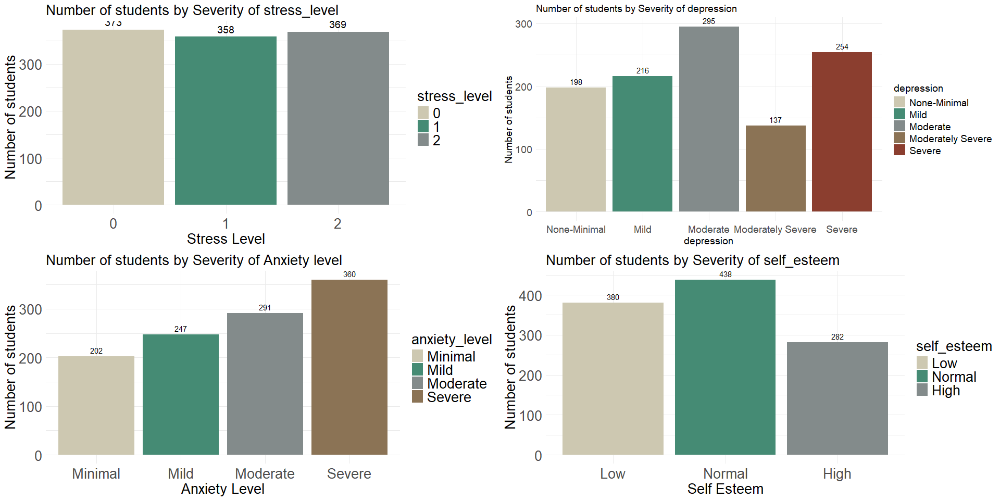
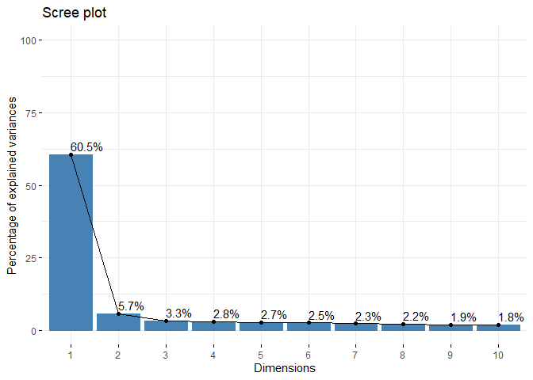

# [Import dữ liệu và các thư viện cần thiết]()


```r
pacman::p_load(
  ggplot2,
  mvtnorm,
  GGally,
  corrplot,
  readxl,
  tidyverse,
  gridExtra,
  grid,
  plotly,
  ggcorrplot,
  FactoMineR,
  factoextra,
  rgl,
  scatterplot3d,
  inspectdf,
  mvnormtest,
  psych
)
```


```r
data = read.csv("data/StressLevelDataset.csv")
head(data)
```

```
##   anxiety_level self_esteem mental_health_history depression headache
## 1            14          20                     0         11        2
## 2            15           8                     1         15        5
## 3            12          18                     1         14        2
## 4            16          12                     1         15        4
## 5            16          28                     0          7        2
## 6            20          13                     1         21        3
##   blood_pressure sleep_quality breathing_problem noise_level living_conditions
## 1              1             2                 4           2                 3
## 2              3             1                 4           3                 1
## 3              1             2                 2           2                 2
## 4              3             1                 3           4                 2
## 5              3             5                 1           3                 2
## 6              3             1                 4           3                 2
##   safety basic_needs academic_performance study_load
## 1      3           2                    3          2
## 2      2           2                    1          4
## 3      3           2                    2          3
## 4      2           2                    2          4
## 5      4           3                    4          3
## 6      2           1                    2          5
##   teacher_student_relationship future_career_concerns social_support
## 1                            3                      3              2
## 2                            1                      5              1
## 3                            3                      2              2
## 4                            1                      4              1
## 5                            1                      2              1
## 6                            2                      5              1
##   peer_pressure extracurricular_activities bullying stress_level
## 1             3                          3        2            1
## 2             4                          5        5            2
## 3             3                          2        2            1
## 4             4                          4        5            2
## 5             5                          0        5            1
## 6             4                          4        5            2
```
# [Thông tin về dữ liệu và phương pháp nghiên cứu]()  
* **Bộ dữ liệu gồm 1100 quan trắc và 21 biến như sau:**  
   1. anxiety-level: Mức độ lo lắng từ 0 (lo lắng thấp) đến 21 (lo lắng cao).  
   2. self-esteem: Lòng tự trọng từ 0 (lòng tự trọng thấp) đến 30 (lòng tự trọng cao).  
   3. mental-health-history: Tiền sử sức khỏe tâm thần, thể hiện liệu học sinh có tiền sử mắc các vấn đề về sức khỏe tâm thần hay không. 
   4. depression: Trầm cảm dao động từ 0 (trầm cảm thấp) đến 27 (trầm cảm cao).    
   5. headache: Tần suất đau đầu mà học sinh gặp phải, dao động từ 0 (không đau đầu) đến 5 (đau đầu thường xuyên).  
   6. blood-pressure: Huyết áp với các giá trị từ 1 (thấp) đến 3 (cao).  
   7. sleep-quality: Chất lượng giấc ngủ thang điểm từ 0 (chất lượng kém) đến 5 (chất lượng tuyệt vời).
   8. breathing-problem: Cho biết học sinh có gặp vấn đề về hô hấp hay không
   9. noise-level: Nhận thức về mức độ tiếng ồn trong môi trường của học sinh, từ 0 (tiếng ồn thấp) đến 5 (tiếng ồn cao).  
   10. living-conditions: Điều kiện sống, các giá trị từ 0 (điều kiện kém) đến 5 (điều kiện tuyệt vời). 
   11. safety: Sự an toàn, từ 0 (không an toàn) đến 5 (rất an toàn).
   12. basic-needs: Nhu cầu cơ bản, từ 0 (không hài lòng) đến 5 (hoàn toàn hài lòng).  
   13. academic-performance: Thành tích học tập, giá trị từ 0 (kém) đến 5 (xuất sắc).  
   14. study-load: Nhận thức của học sinh về khối lượng học tập của mình, từ 0 (nhẹ) đến 5 (nặng).  
   15. teacher-student-relationship: Chất lượng mối quan hệ với giáo viên, với các giá trị từ 0 (kém) đến 5 (xuất sắc).  
   16. future-career-concerns: Mối quan tâm về triển vọng nghề nghiệp trong tương lai, từ 0 (mối quan tâm thấp) đến 5 (mối quan tâm cao). 
   17. social-support: Mức độ hỗ trợ xã hội mà học sinh nhận được, từ 0 (hỗ trợ thấp) đến 3 (hỗ trợ cao).  
   18. peer-pressure: Ảnh hưởng của áp lực từ bạn bè, với giá trị từ 0 (áp lực thấp) đến 5 (áp lực cao). 
   19. extracurricular-activities: Các hoạt động ngoại khóa, từ 0 (không tham gia) đến 5 (tham gia tích cực).  
   20. bullying: Bắt nạt, từ 0 (không bị bắt nạt) đến 5 (thường xuyên bị bắt nạt).   
   21. stress-level: Mức độ căng thẳng, giá trị từ 0 (căng thẳng thấp) đến 2 (căng thẳng cao).
  

```r
str(data)
```

```
## 'data.frame':	1100 obs. of  21 variables:
##  $ anxiety_level               : int  14 15 12 16 16 20 4 17 13 6 ...
##  $ self_esteem                 : int  20 8 18 12 28 13 26 3 22 8 ...
##  $ mental_health_history       : int  0 1 1 1 0 1 0 1 1 0 ...
##  $ depression                  : int  11 15 14 15 7 21 6 22 12 27 ...
##  $ headache                    : int  2 5 2 4 2 3 1 4 3 4 ...
##  $ blood_pressure              : int  1 3 1 3 3 3 2 3 1 3 ...
##  $ sleep_quality               : int  2 1 2 1 5 1 4 1 2 1 ...
##  $ breathing_problem           : int  4 4 2 3 1 4 1 5 4 2 ...
##  $ noise_level                 : int  2 3 2 4 3 3 1 3 3 0 ...
##  $ living_conditions           : int  3 1 2 2 2 2 4 1 3 5 ...
##  $ safety                      : int  3 2 3 2 4 2 4 1 3 2 ...
##  $ basic_needs                 : int  2 2 2 2 3 1 4 1 3 2 ...
##  $ academic_performance        : int  3 1 2 2 4 2 5 1 3 2 ...
##  $ study_load                  : int  2 4 3 4 3 5 1 3 3 2 ...
##  $ teacher_student_relationship: int  3 1 3 1 1 2 4 2 2 1 ...
##  $ future_career_concerns      : int  3 5 2 4 2 5 1 4 3 5 ...
##  $ social_support              : int  2 1 2 1 1 1 3 1 3 1 ...
##  $ peer_pressure               : int  3 4 3 4 5 4 2 4 3 5 ...
##  $ extracurricular_activities  : int  3 5 2 4 0 4 2 4 2 3 ...
##  $ bullying                    : int  2 5 2 5 5 5 1 5 2 4 ...
##  $ stress_level                : int  1 2 1 2 1 2 0 2 1 1 ...
```

```r
summary(data)
```

```
##  anxiety_level    self_esteem    mental_health_history   depression   
##  Min.   : 0.00   Min.   : 0.00   Min.   :0.0000        Min.   : 0.00  
##  1st Qu.: 6.00   1st Qu.:11.00   1st Qu.:0.0000        1st Qu.: 6.00  
##  Median :11.00   Median :19.00   Median :0.0000        Median :12.00  
##  Mean   :11.06   Mean   :17.78   Mean   :0.4927        Mean   :12.56  
##  3rd Qu.:16.00   3rd Qu.:26.00   3rd Qu.:1.0000        3rd Qu.:19.00  
##  Max.   :21.00   Max.   :30.00   Max.   :1.0000        Max.   :27.00  
##     headache     blood_pressure  sleep_quality  breathing_problem
##  Min.   :0.000   Min.   :1.000   Min.   :0.00   Min.   :0.000    
##  1st Qu.:1.000   1st Qu.:1.000   1st Qu.:1.00   1st Qu.:2.000    
##  Median :3.000   Median :2.000   Median :2.50   Median :3.000    
##  Mean   :2.508   Mean   :2.182   Mean   :2.66   Mean   :2.754    
##  3rd Qu.:3.000   3rd Qu.:3.000   3rd Qu.:4.00   3rd Qu.:4.000    
##  Max.   :5.000   Max.   :3.000   Max.   :5.00   Max.   :5.000    
##   noise_level    living_conditions     safety       basic_needs   
##  Min.   :0.000   Min.   :0.000     Min.   :0.000   Min.   :0.000  
##  1st Qu.:2.000   1st Qu.:2.000     1st Qu.:2.000   1st Qu.:2.000  
##  Median :3.000   Median :2.000     Median :2.000   Median :3.000  
##  Mean   :2.649   Mean   :2.518     Mean   :2.737   Mean   :2.773  
##  3rd Qu.:3.000   3rd Qu.:3.000     3rd Qu.:4.000   3rd Qu.:4.000  
##  Max.   :5.000   Max.   :5.000     Max.   :5.000   Max.   :5.000  
##  academic_performance   study_load    teacher_student_relationship
##  Min.   :0.000        Min.   :0.000   Min.   :0.000               
##  1st Qu.:2.000        1st Qu.:2.000   1st Qu.:2.000               
##  Median :2.000        Median :2.000   Median :2.000               
##  Mean   :2.773        Mean   :2.622   Mean   :2.648               
##  3rd Qu.:4.000        3rd Qu.:3.000   3rd Qu.:4.000               
##  Max.   :5.000        Max.   :5.000   Max.   :5.000               
##  future_career_concerns social_support  peer_pressure  
##  Min.   :0.000          Min.   :0.000   Min.   :0.000  
##  1st Qu.:1.000          1st Qu.:1.000   1st Qu.:2.000  
##  Median :2.000          Median :2.000   Median :2.000  
##  Mean   :2.649          Mean   :1.882   Mean   :2.735  
##  3rd Qu.:4.000          3rd Qu.:3.000   3rd Qu.:4.000  
##  Max.   :5.000          Max.   :3.000   Max.   :5.000  
##  extracurricular_activities    bullying      stress_level   
##  Min.   :0.000              Min.   :0.000   Min.   :0.0000  
##  1st Qu.:2.000              1st Qu.:1.000   1st Qu.:0.0000  
##  Median :2.500              Median :3.000   Median :1.0000  
##  Mean   :2.767              Mean   :2.617   Mean   :0.9964  
##  3rd Qu.:4.000              3rd Qu.:4.000   3rd Qu.:2.0000  
##  Max.   :5.000              Max.   :5.000   Max.   :2.0000
```


```r
# Kiểm tra dòng trùng lặp
duplicate_check <- anyDuplicated(data)

# In kết quả
colSums(is.na(data))
```

```
##                anxiety_level                  self_esteem 
##                            0                            0 
##        mental_health_history                   depression 
##                            0                            0 
##                     headache               blood_pressure 
##                            0                            0 
##                sleep_quality            breathing_problem 
##                            0                            0 
##                  noise_level            living_conditions 
##                            0                            0 
##                       safety                  basic_needs 
##                            0                            0 
##         academic_performance                   study_load 
##                            0                            0 
## teacher_student_relationship       future_career_concerns 
##                            0                            0 
##               social_support                peer_pressure 
##                            0                            0 
##   extracurricular_activities                     bullying 
##                            0                            0 
##                 stress_level 
##                            0
```

```r
cat("Có dòng trùng lặp:", duplicate_check > 0, "\n")
```

```
## Có dòng trùng lặp: FALSE
```
# [Tìm hiểu các thông tin hữu ích từ dữ liệu]()  


* **Phân Phối Của Dữ Liệu**


```r
plot_all_histograms <- function(data, fill_color = "skyblue", alpha_value = 0.5, base_size = 15, binwidth = 1) {
  plot_list <- list()
  for (var in names(data)) {
    p = ggplot(data, aes_string(x = var)) +
      geom_histogram(fill = fill_color, color = "blue", alpha = alpha_value, binwidth = binwidth) +  
      theme_minimal(base_size = base_size) + 
      labs(title = var,
           x = "",
           y = "Frequency") +
      geom_rug(sides = "b")
     plot_list[[var]] <- p
  }
  title_grob <- textGrob("Distribution Of Numerical Columns", gp = gpar(fontsize = 25, fontface = "bold"))
  grid.arrange(title_grob, grobs=plot_list, ncol = 7, nrow=3)
}

plot_all_histograms(data)
```

```
## Warning: `aes_string()` was deprecated in ggplot2 3.0.0.
## ℹ Please use tidy evaluation idioms with `aes()`.
## ℹ See also `vignette("ggplot2-in-packages")` for more information.
## This warning is displayed once every 8 hours.
## Call `lifecycle::last_lifecycle_warnings()` to see where this warning was
## generated.
```

<!-- -->

* **Nhận xét:**  
 
1. Anxiety Level  
    - Mức độ lo lắng có phân bố khá đều với sự gia tăng nhẹ về tần suất ở mức cao (20-21).  
    - Phần lớn học sinh có mức độ lo lắng nằm trong khoảng từ 5 đến 20.  
2. Self-Esteem  
    - Lòng tự trọng có phân bố đa dạng với đỉnh ở khoảng 20-30.  
    - Học sinh có lòng tự trọng ở khắp dải (0-30), nhưng sự gia tăng đáng chú ý ở mức 20 cho thấy nhiều học sinh đánh giá lòng tự trọng của họ ở mức cao hơn trung bình.  
3. Mental Health History  
    - Số lượng học sinh có tiền sử về sức khỏe tâm thần nhiều hơn những học sinh bình thường nhưng chênh lệch không nhiều.   
4. Depression    
    - Điểm trầm cảm dao động rộng với đỉnh ở khoảng giữa (10-15).  
5. Headache   
    - Tần suất đau đầu khác nhau, tập trung nhiều ở 1 và 3
    - Điều này cho thấy đau đầu là một vấn đề phổ biến trong số các học sinh được khảo sát.  
6. Blood Pressure  
    - Huyết áp được phân loại thành ba mức (1: thấp, 2: bình thường, 3: cao).  
    - Phần lớn học sinh có huyết áp cao (mức 3), với ít học sinh ở mức thấp (mức 1) và bình thường (mức 2).  
7. Sleep Quality  
    - Phân bố cho thấy nhiều học sinh báo cáo chất lượng giấc ngủ kém (0) trong khi một nhóm nhỏ báo cáo chất lượng giấc ngủ tuyệt vời (5).   
8. Breathing Problem  
    - Các học sinh có vấn đề về hô hấp tập trung nhiều ở mức 2 và mức 4.
    - Chỉ một nhóm nhỏ học sinh không có vấn đề về hô hấp.  
9. Noise Level  
    - Hầu hết học sinh đều chịu tác động tiếng ồn ở mức từ khá đến cao.  
10. Living Conditions  
    - Dàn trải khá chênh lệch, tập trung nhiều ở mức khá.  
11. Safety  
    -  Phần lớn học sinh đều có sự an toàn nhất định, tập trung nhiều ở mức 2 trở đi  
12. Basic Needs  
    - Phân bố cho thấy phần lớn học sinh hài lòng với nhu cầu cơ bản của mình ở mức 2 và 3, với một số ít học sinh hài lòng ở mức cao hơn hoặc thấp hơn  
13. Academic Performance  
    - Phần lớn học sinh có thành tích học tập ở mức 2, với một số ít học sinh có thành tích xuất sắc hoặc kém hơn. Điều này cho thấy phần lớn học sinh có thành tích học tập trung bình.  
14. Study Load  
    - Phân bố cho thấy phần lớn học sinh đánh giá khối lượng học tập của mình ở mức 2 và 3, với một số ít học sinh đánh giá khối lượng học tập ở mức cao hơn hoặc thấp hơn. 
15. Teacher-Student Relationship  
    - Phần lớn học sinh đánh giá mối quan hệ giáo viên-học sinh ở mức trung bình (2 và 3). Họ có mối quan hệ tương đối tốt với giáo viên.  
16. Future Career Concerns  
    - Phân bố cho thấy phần lớn học sinh có mối quan tâm về triển vọng nghề nghiệp ở mức trung bình (2 và 3).  
17. Social Support
    - Phần lớn học sinh cảm thấy họ nhận được sự hỗ trợ xã hội đáng kể. (Mức 2 và 3).  
18. Peer Pressure  
    - Phần lớn học sinh cảm thấy áp lực từ bạn bè ở mức trung bình (2 và 3).  
19. Extracurricular Activities  
    - Phần lớn học sinh có tham gia hoạt động ngoại khóa nhưng không quá tích cực.
20. Bullying  
    - Vấn đề bắt nạt không quá phổ biến trong học sinh. (Mức 0 và 1)
21. Stress Level 
    - Phần lớn học sinh cảm thấy mức độ căng thẳng ở mức trung bình đến cao (1 và 2).  
* **Boxplot của dữ liệu**


```r
# Plot the boxplot of all the columns and outliers
boxplot_all <- function(data, fill_color = "skyblue", alpha_value = 0.5, base_size = 15) {
  plot_list <- list()
  for (var in names(data)) {
    p = ggplot(data, aes_string(x = var)) +
      geom_boxplot(fill = fill_color, color = "blue", alpha = alpha_value) +  
      theme_minimal(base_size = base_size) + 
      labs(title = var,
           x = "",
          ) +
      geom_rug(sides = "l")
    plot_list[[var]] <- p
  }
  title_grob <- textGrob("Boxplot Of Numerical Columns", gp = gpar(fontsize = 25, fontface = "bold"))
  grid.arrange(title_grob, grobs=plot_list, ncol = 7, nrow=3)
}
boxplot_all(data)
```

<!-- -->


* 3D scatter plot


```r
# The 3D plot allows you to visualize the relationship between three variables: anxiety_level, self_esteem, and stress_level. using plotly with clusters
plot_ly(data, x = ~anxiety_level, y = ~self_esteem, z = ~stress_level, color = ~stress_level, colors = c("cornsilk3", "aquamarine4", "azure4"), marker = list(size = 5)) %>%
  add_markers() %>%
  layout(scene = list(xaxis = list(title = "Anxiety Level"),
                      yaxis = list(title = "Self Esteem"),
                      zaxis = list(title = "Stress Level")))
```

```{=html}
<div class="plotly html-widget html-fill-item" id="htmlwidget-d34b45cd05b73001f29d" style="width:672px;height:480px;"></div>
<script type="application/json" data-for="htmlwidget-d34b45cd05b73001f29d">{"x":{"visdat":{"7f0c39bdc6b":["function () ","plotlyVisDat"]},"cur_data":"7f0c39bdc6b","attrs":{"7f0c39bdc6b":{"x":{},"y":{},"z":{},"marker":{"size":5},"color":{},"colors":["cornsilk3","aquamarine4","azure4"],"alpha_stroke":1,"sizes":[10,100],"spans":[1,20],"type":"scatter3d","mode":"markers","inherit":true}},"layout":{"margin":{"b":40,"l":60,"t":25,"r":10},"scene":{"xaxis":{"title":"Anxiety Level"},"yaxis":{"title":"Self Esteem"},"zaxis":{"title":"Stress Level"}},"hovermode":"closest","showlegend":false,"legend":{"yanchor":"top","y":0.5}},"source":"A","config":{"modeBarButtonsToAdd":["hoverclosest","hovercompare"],"showSendToCloud":false},"data":[{"x":[14,15,12,16,16,20,4,17,13,6,17,17,5,9,2,11,6,7,11,21,3,18,7,20,13,6,18,7,13,17,0,15,15,9,7,9,12,7,21,5,5,8,1,19,15,3,19,7,12,2,8,10,6,19,13,13,12,8,4,4,4,8,3,12,21,5,18,11,11,1,5,21,2,0,21,17,20,1,13,18,4,9,17,0,13,10,9,17,11,17,9,16,20,9,8,19,15,17,6,9,13,20,11,12,3,8,19,3,16,15,1,17,5,9,3,17,13,19,18,9,6,18,7,9,13,19,13,6,14,14,5,12,20,14,11,7,6,19,8,10,1,13,11,2,6,2,9,18,9,18,8,9,14,16,18,10,6,12,2,1,13,15,15,11,5,15,10,2,11,9,4,17,13,6,5,15,17,21,4,7,4,20,9,6,11,20,10,3,11,18,6,10,14,11,6,16,17,6,13,2,21,16,16,10,21,20,15,19,17,7,12,16,1,13,8,19,11,9,5,13,19,10,11,19,1,13,4,12,9,9,3,4,3,13,15,16,21,13,11,6,9,12,12,14,6,7,6,21,16,7,16,13,5,13,5,11,7,1,11,5,8,12,8,14,9,12,10,16,1,8,9,7,19,21,7,7,16,15,14,13,19,5,18,20,13,1,1,7,15,16,9,1,0,21,16,12,4,11,9,10,2,13,2,18,4,1,2,10,20,10,7,10,12,14,0,7,18,8,3,14,2,6,19,20,1,10,3,3,21,12,11,3,2,2,12,2,12,3,8,17,21,10,18,21,21,21,15,21,15,18,14,11,11,19,19,19,7,10,6,6,17,12,9,8,13,2,17,8,5,2,2,21,2,13,20,17,14,4,17,2,9,5,18,10,21,19,14,10,16,0,14,21,12,6,18,5,10,0,19,15,21,19,7,16,12,16,17,3,12,14,13,2,13,11,10,20,3,15,0,4,1,1,18,16,11,7,18,9,1,16,8,9,8,3,3,12,3,21,4,7,7,3,3,15,11,21,16,18,21,20,15,7,18,17,1,12,3,5,14,13,18,15,11,14,15,3,18,19,17,18,16,12,8,3,6,2,20,17,13,1,21,11,16,15,20,18,2,16,6,14,15,19,13,13,4,13,13,0,14,15,3,19,6,5,16,2,13,9,18,11,1,18,5,20,13,12,8,0,20,10,19,12,13,15,10,13,7,16,11,4,6,11,9,7,10,17,11,19,18,21,19,6,16,6,7,17,12,5,11,11,8,12,7,10,14,4,8,15,16,0,9,14,16,19,9,10,2,17,8,13,13,5,19,5,18,10,6,7,13,4,20,0,7,1,0,12,7,20,1,5,14,19,5,19,11,9,19,4,11,7,5,20,21,13,0,2,19,2,12,2,9,9,13,1,1,11,20,11,9,14,13,4,11,12,2,13,10,10,0,10,3,19,4,15,11,20,10,6,0,10,5,21,17,5,18,9,2,3,6,9,7,6,8,8,1,13,21,2,9,11,10,21,17,0,6,10,10,7,12,1,10,8,7,14,14,2,9,21,1,11,15,7,14,7,11,4,16,21,3,16,0,12,6,7,8,0,13,1,18,15,19,2,7,10,8,7,18,1,21,20,7,15,9,19,17,1,19,21,12,13,16,20,17,1,12,13,15,19,18,3,4,3,18,9,14,0,18,15,21,10,14,6,12,21,3,3,12,21,10,6,16,6,18,2,21,19,12,17,3,10,5,11,20,13,13,9,2,21,0,20,8,14,1,18,0,14,3,16,15,2,19,2,14,2,7,21,13,8,10,15,19,19,17,9,18,13,8,19,10,19,19,13,4,11,20,21,16,3,18,18,12,10,9,5,11,8,17,8,13,16,13,21,12,14,14,6,18,14,12,5,3,13,15,6,18,11,21,12,8,10,9,20,11,1,15,17,8,20,8,5,14,10,18,21,4,12,14,7,19,18,10,11,15,5,14,2,3,14,1,12,10,14,12,7,3,12,13,0,9,3,9,14,8,0,15,16,3,8,14,16,18,15,21,13,16,17,14,15,20,8,1,6,21,1,15,8,10,4,18,18,6,1,3,14,9,18,8,3,13,7,12,14,17,0,18,12,13,11,15,9,2,19,19,17,10,6,4,20,9,21,11,2,10,15,17,19,12,17,20,20,10,18,19,18,1,10,21,15,3,6,21,18,6,17,4,9,16,10,4,11,13,17,7,21,1,20,6,10,17,18,7,10,17,19,9,19,21,8,21,2,9,9,3,17,0,9,15,6,5,0,13,9,5,19,6,14,10,2,12,19,14,1,0,21,21,10,3,8,5,19,5,21,17,9,5,21,19,12,17,16,6,14,18,1,19,3,7,5,10,20,5,21,6,10,15,12,10,11,20,1,7,3,14,12,20,8,2,12,10,16,15,6,1,1,16,11,21,14,2,13,19,16,15,14,10,13,15,4,0,3,2,15,10,21,6,19,9,4,20,19,6,19,13,1,7,11,9,4,21,18],"y":[20,8,18,12,28,13,26,3,22,8,12,15,28,23,28,21,28,25,23,1,27,1,27,5,21,26,6,28,23,6,27,8,9,23,25,22,21,27,6,25,29,30,27,9,4,30,1,27,19,26,27,16,29,2,23,23,18,28,29,27,28,29,27,23,0,25,14,21,23,26,30,15,26,30,7,5,5,29,17,13,26,21,15,26,15,24,22,3,18,12,19,11,1,23,0,7,14,7,27,23,3,3,17,15,29,26,11,28,9,6,29,4,27,24,2,12,21,7,8,23,28,0,29,20,20,16,15,26,3,19,27,16,13,16,21,24,25,13,28,25,5,27,17,29,3,27,17,3,21,14,29,19,22,15,1,25,30,15,30,30,22,15,12,15,30,4,15,30,20,15,25,9,15,29,26,0,15,5,25,25,29,6,22,28,4,13,20,29,16,7,11,21,23,20,17,4,12,28,21,23,13,9,9,24,7,5,7,10,13,13,15,11,26,24,29,6,19,24,26,6,24,23,24,3,30,24,8,19,17,22,26,30,30,20,9,13,2,25,21,26,22,22,16,21,26,27,30,7,10,27,6,18,25,20,30,20,28,30,20,20,26,19,30,24,17,18,25,11,29,28,25,30,2,4,29,21,15,8,11,16,13,27,7,9,1,27,8,30,8,9,30,29,26,18,5,22,9,24,17,21,28,23,23,7,26,21,28,23,0,21,30,17,16,22,28,26,7,28,26,18,2,28,11,6,16,20,30,28,15,19,16,29,25,28,17,26,15,0,30,7,3,19,2,4,15,8,8,0,7,15,23,16,15,1,14,14,26,17,29,29,29,19,15,28,15,25,29,29,30,30,27,4,9,19,3,0,20,28,13,23,20,25,1,18,27,7,21,23,11,25,23,0,16,26,1,25,11,26,8,8,11,1,30,9,7,7,11,25,3,18,20,11,19,15,25,11,0,0,30,26,28,27,7,1,21,26,14,20,28,11,4,22,29,27,29,16,28,3,21,26,25,4,28,13,15,11,15,9,13,28,14,30,4,9,19,10,29,2,17,2,0,12,23,18,13,26,6,9,23,7,11,23,29,25,19,18,9,12,16,29,4,16,7,6,8,10,26,1,18,17,11,5,17,14,2,19,14,27,19,13,27,11,29,2,12,27,18,17,6,6,25,16,26,15,22,23,30,28,6,16,23,17,23,12,18,15,29,15,18,28,28,22,17,25,20,11,21,14,11,2,14,30,4,27,27,23,21,30,20,15,29,17,26,24,30,28,26,11,13,30,18,16,10,14,19,24,25,3,30,25,22,8,0,25,26,20,29,11,23,28,14,25,25,24,25,24,29,1,26,1,15,2,15,15,18,22,6,11,18,25,25,5,7,17,27,29,27,15,22,27,16,25,22,29,30,25,15,19,23,19,17,29,24,17,30,15,22,22,26,25,28,13,30,6,5,2,24,29,26,21,30,7,10,30,10,16,27,26,16,29,25,30,25,28,27,17,8,25,16,23,20,11,13,25,26,15,18,25,17,11,18,26,26,24,17,6,21,11,20,23,0,26,15,25,15,27,9,8,26,11,27,1,21,27,25,25,21,30,8,13,1,29,27,21,30,27,7,27,7,11,2,1,25,15,0,2,0,0,24,19,9,3,14,29,17,15,6,8,8,28,26,30,13,15,20,27,9,0,6,19,22,29,28,20,30,21,16,12,17,27,15,5,24,27,3,14,25,6,25,20,29,17,0,18,25,17,25,4,27,6,28,25,25,1,28,30,25,10,8,10,3,25,17,30,15,3,24,26,24,1,13,14,2,21,8,17,30,6,16,1,12,6,30,21,10,13,1,28,10,12,24,24,16,25,23,6,28,28,16,8,16,28,19,25,21,20,5,18,25,27,28,24,12,26,10,22,4,21,30,21,22,3,16,25,10,2,30,4,7,26,16,20,0,19,27,16,21,13,25,28,15,22,7,27,16,30,9,23,26,22,20,19,17,26,25,17,17,27,17,26,24,23,29,28,30,13,30,4,25,14,15,6,9,23,4,5,16,6,11,30,26,25,10,25,11,29,21,27,7,8,25,28,27,25,21,12,28,9,16,22,25,23,2,27,13,19,21,20,3,20,25,13,9,12,25,27,25,0,23,11,20,27,23,3,15,13,0,1,6,10,24,11,13,6,27,25,12,6,27,29,5,14,30,9,28,24,14,20,29,20,25,2,25,1,26,11,25,21,24,2,26,20,10,2,29,10,3,28,8,30,23,17,5,14,25,23,1,27,29,25,25,19,20,3,25,17,16,26,21,11,25,7,25,8,30,23,29,27,26,0,30,3,5,29,27,1,27,22,10,1,26,23,5,28,12,17,25,9,25,10,23,15,13,24,1,20,19,8,19,27,30,29,12,5,11,6,27,17,15,12,12,30,28,26,3,23,14,18,26,25,5,12,13,16,18,16,13,25,28,10,15,7,25,1,4,3,13,29,10,16,11,11,20,30,17,17,12,26,0,6],"z":[1,2,1,2,1,2,0,2,1,1,2,2,0,2,0,1,0,0,1,2,0,2,0,2,1,0,2,0,1,2,0,1,2,1,0,1,1,0,2,0,0,0,0,2,2,0,2,0,1,0,0,1,0,2,1,1,1,0,0,0,0,1,0,1,0,0,2,1,1,1,0,2,0,0,2,2,2,0,1,2,0,1,2,0,1,1,1,2,1,2,1,2,2,2,0,1,2,2,0,1,1,1,1,1,0,0,2,0,2,2,0,2,0,1,2,2,1,2,2,1,0,2,0,1,1,0,1,0,2,1,0,1,0,1,1,0,0,2,0,1,2,0,1,0,2,0,1,2,1,2,0,1,1,2,2,1,0,1,0,0,1,1,2,1,0,2,1,0,1,1,0,2,1,0,0,2,2,2,1,0,0,2,1,0,2,2,1,0,1,2,1,1,2,1,2,2,2,0,1,0,2,2,2,1,0,2,2,2,2,2,1,0,0,1,0,2,1,1,0,0,1,1,1,2,0,1,2,1,1,1,0,0,0,1,2,2,2,1,1,0,1,1,1,1,0,0,0,2,2,0,2,1,0,1,0,1,0,0,1,1,0,1,0,1,1,1,1,2,0,0,1,0,2,2,0,0,2,2,1,1,2,0,2,2,2,2,2,0,2,2,0,0,0,0,2,1,0,1,1,1,0,1,0,2,0,1,0,1,2,1,0,1,0,1,0,0,2,0,0,1,0,0,2,2,1,1,0,0,2,1,1,0,0,0,1,0,1,0,0,1,2,1,2,2,2,2,2,2,2,2,1,1,1,2,2,2,0,1,0,0,0,1,1,0,1,0,0,0,0,0,0,2,2,1,2,2,1,0,2,1,1,0,2,1,0,2,1,1,2,0,1,2,1,2,2,0,2,0,2,2,2,2,0,2,1,0,2,0,0,1,1,2,1,1,1,2,2,2,0,0,2,0,1,2,1,0,2,1,0,2,2,1,0,0,0,1,0,1,1,0,0,1,0,2,1,2,2,2,2,0,2,0,1,2,0,0,0,1,1,1,2,2,1,1,2,0,2,2,2,2,2,1,0,0,1,0,1,2,1,0,2,1,1,2,2,2,0,0,1,1,2,2,1,1,0,1,0,0,1,2,0,2,0,1,2,0,1,1,2,2,0,2,0,2,1,1,0,0,2,1,1,0,1,2,1,1,0,2,1,0,0,1,1,0,0,2,1,2,2,2,2,0,2,0,0,2,1,0,1,1,0,1,0,1,0,0,0,2,0,0,1,1,2,2,1,1,0,2,0,1,1,2,2,0,0,1,0,0,1,0,2,0,0,0,0,1,0,2,0,2,1,2,2,2,1,1,2,1,1,0,0,2,2,1,0,0,2,0,1,0,1,1,1,0,0,1,2,1,1,1,1,0,1,1,0,1,1,1,0,1,0,2,0,2,1,2,1,1,0,1,0,2,2,0,2,1,0,0,0,1,0,0,0,0,0,1,2,0,1,1,1,2,2,0,0,1,1,0,0,0,1,0,0,1,1,2,1,2,0,1,2,0,1,0,1,0,2,2,0,2,2,2,1,0,0,0,1,0,2,2,2,0,0,1,0,0,2,0,2,2,2,2,1,2,2,2,2,2,1,1,2,2,2,0,1,1,2,2,2,0,0,0,2,1,1,0,2,2,2,1,1,0,1,2,0,0,1,2,1,0,2,0,1,0,2,2,1,2,0,1,0,1,2,1,1,1,0,2,2,2,0,1,0,2,0,2,0,2,2,0,2,0,1,0,0,2,1,0,1,2,2,2,2,1,0,1,0,2,1,2,0,0,0,1,2,2,2,0,2,2,1,2,1,0,1,0,1,0,1,2,1,1,1,1,1,2,2,1,2,0,0,1,2,0,2,1,2,1,0,1,1,2,1,0,2,2,0,2,0,0,1,1,2,1,0,2,1,2,0,2,1,2,2,0,1,0,2,1,0,1,1,1,1,0,0,1,1,0,1,0,1,1,0,0,1,2,0,2,1,2,2,2,2,1,2,2,1,0,0,0,0,0,1,0,2,0,1,0,2,2,0,0,0,1,1,2,0,1,1,2,1,1,2,0,2,1,1,1,2,1,0,2,2,2,1,0,0,2,1,2,1,0,1,2,2,2,2,2,2,2,1,2,2,2,0,1,2,2,0,0,2,2,0,2,0,1,2,1,0,1,1,2,0,2,0,2,0,1,2,2,0,1,2,2,0,2,2,0,2,0,1,1,2,2,0,1,2,0,0,0,1,1,1,1,0,1,1,0,1,2,1,2,0,0,0,1,0,0,0,2,0,2,2,0,0,2,1,1,2,2,0,1,2,0,2,0,0,1,1,2,2,2,0,1,2,1,1,2,0,0,0,0,2,1,2,0,0,1,1,2,2,0,0,0,2,2,2,1,0,1,2,2,2,0,1,1,2,0,0,2,2,2,1,2,2,2,0,0,2,0,0,2,1,0,2,1,2,0,2,2],"marker":{"colorbar":{"title":"stress_level","ticklen":2},"cmin":0,"cmax":2,"colorscale":[["0","rgba(205,200,177,1)"],["0.0416666666666667","rgba(194,195,172,1)"],["0.0833333333333333","rgba(183,190,167,1)"],["0.125","rgba(172,185,161,1)"],["0.166666666666667","rgba(162,180,156,1)"],["0.208333333333333","rgba(151,175,151,1)"],["0.25","rgba(140,170,146,1)"],["0.291666666666667","rgba(129,165,141,1)"],["0.333333333333333","rgba(117,159,136,1)"],["0.375","rgba(106,154,131,1)"],["0.416666666666667","rgba(94,149,126,1)"],["0.458333333333333","rgba(82,144,121,1)"],["0.5","rgba(69,139,116,1)"],["0.541666666666667","rgba(75,139,118,1)"],["0.583333333333333","rgba(81,139,120,1)"],["0.625","rgba(87,139,122,1)"],["0.666666666666667","rgba(93,139,124,1)"],["0.708333333333333","rgba(98,139,126,1)"],["0.75","rgba(103,139,127,1)"],["0.791666666666667","rgba(108,139,129,1)"],["0.833333333333333","rgba(113,139,131,1)"],["0.875","rgba(117,139,133,1)"],["0.916666666666667","rgba(122,139,135,1)"],["0.958333333333333","rgba(127,139,137,1)"],["1","rgba(131,139,139,1)"]],"showscale":false,"color":[1,2,1,2,1,2,0,2,1,1,2,2,0,2,0,1,0,0,1,2,0,2,0,2,1,0,2,0,1,2,0,1,2,1,0,1,1,0,2,0,0,0,0,2,2,0,2,0,1,0,0,1,0,2,1,1,1,0,0,0,0,1,0,1,0,0,2,1,1,1,0,2,0,0,2,2,2,0,1,2,0,1,2,0,1,1,1,2,1,2,1,2,2,2,0,1,2,2,0,1,1,1,1,1,0,0,2,0,2,2,0,2,0,1,2,2,1,2,2,1,0,2,0,1,1,0,1,0,2,1,0,1,0,1,1,0,0,2,0,1,2,0,1,0,2,0,1,2,1,2,0,1,1,2,2,1,0,1,0,0,1,1,2,1,0,2,1,0,1,1,0,2,1,0,0,2,2,2,1,0,0,2,1,0,2,2,1,0,1,2,1,1,2,1,2,2,2,0,1,0,2,2,2,1,0,2,2,2,2,2,1,0,0,1,0,2,1,1,0,0,1,1,1,2,0,1,2,1,1,1,0,0,0,1,2,2,2,1,1,0,1,1,1,1,0,0,0,2,2,0,2,1,0,1,0,1,0,0,1,1,0,1,0,1,1,1,1,2,0,0,1,0,2,2,0,0,2,2,1,1,2,0,2,2,2,2,2,0,2,2,0,0,0,0,2,1,0,1,1,1,0,1,0,2,0,1,0,1,2,1,0,1,0,1,0,0,2,0,0,1,0,0,2,2,1,1,0,0,2,1,1,0,0,0,1,0,1,0,0,1,2,1,2,2,2,2,2,2,2,2,1,1,1,2,2,2,0,1,0,0,0,1,1,0,1,0,0,0,0,0,0,2,2,1,2,2,1,0,2,1,1,0,2,1,0,2,1,1,2,0,1,2,1,2,2,0,2,0,2,2,2,2,0,2,1,0,2,0,0,1,1,2,1,1,1,2,2,2,0,0,2,0,1,2,1,0,2,1,0,2,2,1,0,0,0,1,0,1,1,0,0,1,0,2,1,2,2,2,2,0,2,0,1,2,0,0,0,1,1,1,2,2,1,1,2,0,2,2,2,2,2,1,0,0,1,0,1,2,1,0,2,1,1,2,2,2,0,0,1,1,2,2,1,1,0,1,0,0,1,2,0,2,0,1,2,0,1,1,2,2,0,2,0,2,1,1,0,0,2,1,1,0,1,2,1,1,0,2,1,0,0,1,1,0,0,2,1,2,2,2,2,0,2,0,0,2,1,0,1,1,0,1,0,1,0,0,0,2,0,0,1,1,2,2,1,1,0,2,0,1,1,2,2,0,0,1,0,0,1,0,2,0,0,0,0,1,0,2,0,2,1,2,2,2,1,1,2,1,1,0,0,2,2,1,0,0,2,0,1,0,1,1,1,0,0,1,2,1,1,1,1,0,1,1,0,1,1,1,0,1,0,2,0,2,1,2,1,1,0,1,0,2,2,0,2,1,0,0,0,1,0,0,0,0,0,1,2,0,1,1,1,2,2,0,0,1,1,0,0,0,1,0,0,1,1,2,1,2,0,1,2,0,1,0,1,0,2,2,0,2,2,2,1,0,0,0,1,0,2,2,2,0,0,1,0,0,2,0,2,2,2,2,1,2,2,2,2,2,1,1,2,2,2,0,1,1,2,2,2,0,0,0,2,1,1,0,2,2,2,1,1,0,1,2,0,0,1,2,1,0,2,0,1,0,2,2,1,2,0,1,0,1,2,1,1,1,0,2,2,2,0,1,0,2,0,2,0,2,2,0,2,0,1,0,0,2,1,0,1,2,2,2,2,1,0,1,0,2,1,2,0,0,0,1,2,2,2,0,2,2,1,2,1,0,1,0,1,0,1,2,1,1,1,1,1,2,2,1,2,0,0,1,2,0,2,1,2,1,0,1,1,2,1,0,2,2,0,2,0,0,1,1,2,1,0,2,1,2,0,2,1,2,2,0,1,0,2,1,0,1,1,1,1,0,0,1,1,0,1,0,1,1,0,0,1,2,0,2,1,2,2,2,2,1,2,2,1,0,0,0,0,0,1,0,2,0,1,0,2,2,0,0,0,1,1,2,0,1,1,2,1,1,2,0,2,1,1,1,2,1,0,2,2,2,1,0,0,2,1,2,1,0,1,2,2,2,2,2,2,2,1,2,2,2,0,1,2,2,0,0,2,2,0,2,0,1,2,1,0,1,1,2,0,2,0,2,0,1,2,2,0,1,2,2,0,2,2,0,2,0,1,1,2,2,0,1,2,0,0,0,1,1,1,1,0,1,1,0,1,2,1,2,0,0,0,1,0,0,0,2,0,2,2,0,0,2,1,1,2,2,0,1,2,0,2,0,0,1,1,2,2,2,0,1,2,1,1,2,0,0,0,0,2,1,2,0,0,1,1,2,2,0,0,0,2,2,2,1,0,1,2,2,2,0,1,1,2,0,0,2,2,2,1,2,2,2,0,0,2,0,0,2,1,0,2,1,2,0,2,2],"size":5,"line":{"colorbar":{"title":"","ticklen":2},"cmin":0,"cmax":2,"colorscale":[["0","rgba(205,200,177,1)"],["0.0416666666666667","rgba(194,195,172,1)"],["0.0833333333333333","rgba(183,190,167,1)"],["0.125","rgba(172,185,161,1)"],["0.166666666666667","rgba(162,180,156,1)"],["0.208333333333333","rgba(151,175,151,1)"],["0.25","rgba(140,170,146,1)"],["0.291666666666667","rgba(129,165,141,1)"],["0.333333333333333","rgba(117,159,136,1)"],["0.375","rgba(106,154,131,1)"],["0.416666666666667","rgba(94,149,126,1)"],["0.458333333333333","rgba(82,144,121,1)"],["0.5","rgba(69,139,116,1)"],["0.541666666666667","rgba(75,139,118,1)"],["0.583333333333333","rgba(81,139,120,1)"],["0.625","rgba(87,139,122,1)"],["0.666666666666667","rgba(93,139,124,1)"],["0.708333333333333","rgba(98,139,126,1)"],["0.75","rgba(103,139,127,1)"],["0.791666666666667","rgba(108,139,129,1)"],["0.833333333333333","rgba(113,139,131,1)"],["0.875","rgba(117,139,133,1)"],["0.916666666666667","rgba(122,139,135,1)"],["0.958333333333333","rgba(127,139,137,1)"],["1","rgba(131,139,139,1)"]],"showscale":false,"color":[1,2,1,2,1,2,0,2,1,1,2,2,0,2,0,1,0,0,1,2,0,2,0,2,1,0,2,0,1,2,0,1,2,1,0,1,1,0,2,0,0,0,0,2,2,0,2,0,1,0,0,1,0,2,1,1,1,0,0,0,0,1,0,1,0,0,2,1,1,1,0,2,0,0,2,2,2,0,1,2,0,1,2,0,1,1,1,2,1,2,1,2,2,2,0,1,2,2,0,1,1,1,1,1,0,0,2,0,2,2,0,2,0,1,2,2,1,2,2,1,0,2,0,1,1,0,1,0,2,1,0,1,0,1,1,0,0,2,0,1,2,0,1,0,2,0,1,2,1,2,0,1,1,2,2,1,0,1,0,0,1,1,2,1,0,2,1,0,1,1,0,2,1,0,0,2,2,2,1,0,0,2,1,0,2,2,1,0,1,2,1,1,2,1,2,2,2,0,1,0,2,2,2,1,0,2,2,2,2,2,1,0,0,1,0,2,1,1,0,0,1,1,1,2,0,1,2,1,1,1,0,0,0,1,2,2,2,1,1,0,1,1,1,1,0,0,0,2,2,0,2,1,0,1,0,1,0,0,1,1,0,1,0,1,1,1,1,2,0,0,1,0,2,2,0,0,2,2,1,1,2,0,2,2,2,2,2,0,2,2,0,0,0,0,2,1,0,1,1,1,0,1,0,2,0,1,0,1,2,1,0,1,0,1,0,0,2,0,0,1,0,0,2,2,1,1,0,0,2,1,1,0,0,0,1,0,1,0,0,1,2,1,2,2,2,2,2,2,2,2,1,1,1,2,2,2,0,1,0,0,0,1,1,0,1,0,0,0,0,0,0,2,2,1,2,2,1,0,2,1,1,0,2,1,0,2,1,1,2,0,1,2,1,2,2,0,2,0,2,2,2,2,0,2,1,0,2,0,0,1,1,2,1,1,1,2,2,2,0,0,2,0,1,2,1,0,2,1,0,2,2,1,0,0,0,1,0,1,1,0,0,1,0,2,1,2,2,2,2,0,2,0,1,2,0,0,0,1,1,1,2,2,1,1,2,0,2,2,2,2,2,1,0,0,1,0,1,2,1,0,2,1,1,2,2,2,0,0,1,1,2,2,1,1,0,1,0,0,1,2,0,2,0,1,2,0,1,1,2,2,0,2,0,2,1,1,0,0,2,1,1,0,1,2,1,1,0,2,1,0,0,1,1,0,0,2,1,2,2,2,2,0,2,0,0,2,1,0,1,1,0,1,0,1,0,0,0,2,0,0,1,1,2,2,1,1,0,2,0,1,1,2,2,0,0,1,0,0,1,0,2,0,0,0,0,1,0,2,0,2,1,2,2,2,1,1,2,1,1,0,0,2,2,1,0,0,2,0,1,0,1,1,1,0,0,1,2,1,1,1,1,0,1,1,0,1,1,1,0,1,0,2,0,2,1,2,1,1,0,1,0,2,2,0,2,1,0,0,0,1,0,0,0,0,0,1,2,0,1,1,1,2,2,0,0,1,1,0,0,0,1,0,0,1,1,2,1,2,0,1,2,0,1,0,1,0,2,2,0,2,2,2,1,0,0,0,1,0,2,2,2,0,0,1,0,0,2,0,2,2,2,2,1,2,2,2,2,2,1,1,2,2,2,0,1,1,2,2,2,0,0,0,2,1,1,0,2,2,2,1,1,0,1,2,0,0,1,2,1,0,2,0,1,0,2,2,1,2,0,1,0,1,2,1,1,1,0,2,2,2,0,1,0,2,0,2,0,2,2,0,2,0,1,0,0,2,1,0,1,2,2,2,2,1,0,1,0,2,1,2,0,0,0,1,2,2,2,0,2,2,1,2,1,0,1,0,1,0,1,2,1,1,1,1,1,2,2,1,2,0,0,1,2,0,2,1,2,1,0,1,1,2,1,0,2,2,0,2,0,0,1,1,2,1,0,2,1,2,0,2,1,2,2,0,1,0,2,1,0,1,1,1,1,0,0,1,1,0,1,0,1,1,0,0,1,2,0,2,1,2,2,2,2,1,2,2,1,0,0,0,0,0,1,0,2,0,1,0,2,2,0,0,0,1,1,2,0,1,1,2,1,1,2,0,2,1,1,1,2,1,0,2,2,2,1,0,0,2,1,2,1,0,1,2,2,2,2,2,2,2,1,2,2,2,0,1,2,2,0,0,2,2,0,2,0,1,2,1,0,1,1,2,0,2,0,2,0,1,2,2,0,1,2,2,0,2,2,0,2,0,1,1,2,2,0,1,2,0,0,0,1,1,1,1,0,1,1,0,1,2,1,2,0,0,0,1,0,0,0,2,0,2,2,0,0,2,1,1,2,2,0,1,2,0,2,0,0,1,1,2,2,2,0,1,2,1,1,2,0,0,0,0,2,1,2,0,0,1,1,2,2,0,0,0,2,2,2,1,0,1,2,2,2,0,1,1,2,0,0,2,2,2,1,2,2,2,0,0,2,0,0,2,1,0,2,1,2,0,2,2]}},"type":"scatter3d","mode":"markers","frame":null},{"x":[0,21],"y":[0,30],"type":"scatter3d","mode":"markers","opacity":0,"hoverinfo":"none","showlegend":false,"marker":{"colorbar":{"title":"stress_level","ticklen":2,"len":0.5,"lenmode":"fraction","y":1,"yanchor":"top"},"cmin":0,"cmax":2,"colorscale":[["0","rgba(205,200,177,1)"],["0.0416666666666667","rgba(194,195,172,1)"],["0.0833333333333333","rgba(183,190,167,1)"],["0.125","rgba(172,185,161,1)"],["0.166666666666667","rgba(162,180,156,1)"],["0.208333333333333","rgba(151,175,151,1)"],["0.25","rgba(140,170,146,1)"],["0.291666666666667","rgba(129,165,141,1)"],["0.333333333333333","rgba(117,159,136,1)"],["0.375","rgba(106,154,131,1)"],["0.416666666666667","rgba(94,149,126,1)"],["0.458333333333333","rgba(82,144,121,1)"],["0.5","rgba(69,139,116,1)"],["0.541666666666667","rgba(75,139,118,1)"],["0.583333333333333","rgba(81,139,120,1)"],["0.625","rgba(87,139,122,1)"],["0.666666666666667","rgba(93,139,124,1)"],["0.708333333333333","rgba(98,139,126,1)"],["0.75","rgba(103,139,127,1)"],["0.791666666666667","rgba(108,139,129,1)"],["0.833333333333333","rgba(113,139,131,1)"],["0.875","rgba(117,139,133,1)"],["0.916666666666667","rgba(122,139,135,1)"],["0.958333333333333","rgba(127,139,137,1)"],["1","rgba(131,139,139,1)"]],"showscale":true,"color":[0,2],"line":{"color":"rgba(255,127,14,1)"}},"z":[0,2],"frame":null}],"highlight":{"on":"plotly_click","persistent":false,"dynamic":false,"selectize":false,"opacityDim":0.20000000000000001,"selected":{"opacity":1},"debounce":0},"shinyEvents":["plotly_hover","plotly_click","plotly_selected","plotly_relayout","plotly_brushed","plotly_brushing","plotly_clickannotation","plotly_doubleclick","plotly_deselect","plotly_afterplot","plotly_sunburstclick"],"base_url":"https://plot.ly"},"evals":[],"jsHooks":[]}</script>
```


* **Correlation of the data**


```r
corrplot(cor(data),
         method = "number",
         type = "upper",
         order = "hclust",
         tl.col = "black",
         tl.srt = 45)
```

<!-- -->

Hệ số tương quan giữa mức độ căng thẳng và các chỉ số sức khỏe là dương và có ý nghĩa đối với hầu hết các chỉ số sức khỏe. Điều này có nghĩa là khi mức độ căng thẳng tăng lên, các chỉ số sức khỏe cũng tăng theo. Điều này cho thấy rằng căng thẳng có liên quan đến một số hậu quả tiêu cực đối với sức khỏe.  
 
Mối tương quan mạnh nhất là giữa mức độ căng thẳng và kiệt sức, với hệ số tương quan là 0,675. Điều này cho thấy rằng kiệt sức là hậu quả rất phổ biến của căng thẳng.  

Các chỉ số sức khỏe khác có mối tương quan mạnh với mức độ căng thẳng bao gồm:  

- Trầm cảm (hệ số tương quan = 0,73)  
- Lo lắng (hệ số tương quan = 0,74)  
- Đau đầu (hệ số tương quan = 0,71)  
- Chất lượng giấc ngủ (hệ số tương quan = -0,75)  

Mối tương quan âm giữa mức độ căng thẳng và chất lượng giấc ngủ cho thấy rằng căng thẳng có thể dẫn đến chất lượng giấc ngủ kém. Đổi lại, chất lượng giấc ngủ kém có thể dẫn đến mức độ căng thẳng tăng cao. Điều này có thể tạo ra một vòng luẩn quẩn.  

# [EDA]()

* **Phân loại dữ liệu**
Trong tập dữ liệu này, có ba cột sẽ được chuyển đổi thành các danh mục dựa trên các tỷ lệ nhất định. Ba cột là ```anxiety_level```, ```self_esteem``` và ```depression```.

* Với ```anxiety_level```:
    - 0-4: Minimal  
    - 5-9: Mild  
    - 10-14: Moderate 
    - > 14: Severe
* Với ```depression```:
    - 0-4: None-minimal    
    - 5-9: Mild  
    - 10-14: Moderate
    - 15-19: Moderately Severe  
    - 20-27: Severe  
* Với ```self_esteem```:
    - 0-14: Low  
    - 15-25: Normal   
    - 26-30: High  


```r
eda = data
```


```r
eda$anxiety_level <- ifelse(eda$anxiety_level < 5, "Minimal",
                       ifelse(eda$anxiety_level >=5 & eda$anxiety_level < 10, "Mild",
                       ifelse(eda$anxiety_level >=10 & eda$anxiety_level < 15, "Moderate", "Severe")))

eda$depression <- ifelse(eda$depression < 5, "None-Minimal",
                    ifelse(eda$depression >=5 & eda$depression < 10, "Mild",
                    ifelse(eda$depression >=10 & eda$depression < 15, "Moderate",
                    ifelse(eda$depression >=15 & eda$depression < 20, "Moderately Severe", "Severe"))))

eda$self_esteem <- ifelse(eda$self_esteem < 15, "Low",
                     ifelse(eda$self_esteem >=15 & eda$self_esteem <= 25, "Normal", "High"))
```


* Kiểu dữ liệu cho mỗi cột có thể được thay đổi thành loại yếu tố vì tập dữ liệu có số lượng lớp tương đối nhỏ, cụ thể là từ 2 đến 6 lớp. Sau khi thay đổi kiểu dữ liệu, các cấp độ lớp trong các cột anxiety_level, self_esteem và depression được đặt từ lớp nhỏ nhất đến lớp cao nhất.

```r
eda <- eda %>% 
  mutate_all(as.factor)
```


```r
eda$anxiety_level <- factor(eda$anxiety_level, levels=c("Minimal", "Mild", "Moderate", "Severe"))
eda$self_esteem <- factor(eda$self_esteem, levels=c("Low", "Normal", "High"))
eda$depression <- factor(eda$depression, levels=c("None-Minimal", "Mild", "Moderate", "Moderately Severe", "Severe"))
```


```r
glimpse(eda)
```

```
## Rows: 1,100
## Columns: 21
## $ anxiety_level                <fct> Moderate, Severe, Moderate, Severe, Sever…
## $ self_esteem                  <fct> Normal, Low, Normal, Low, High, Low, High…
## $ mental_health_history        <fct> 0, 1, 1, 1, 0, 1, 0, 1, 1, 0, 1, 1, 0, 1,…
## $ depression                   <fct> Moderate, Moderately Severe, Moderate, Mo…
## $ headache                     <fct> 2, 5, 2, 4, 2, 3, 1, 4, 3, 4, 4, 3, 1, 4,…
## $ blood_pressure               <fct> 1, 3, 1, 3, 3, 3, 2, 3, 1, 3, 3, 3, 2, 3,…
## $ sleep_quality                <fct> 2, 1, 2, 1, 5, 1, 4, 1, 2, 1, 1, 1, 4, 1,…
## $ breathing_problem            <fct> 4, 4, 2, 3, 1, 4, 1, 5, 4, 2, 3, 5, 2, 0,…
## $ noise_level                  <fct> 2, 3, 2, 4, 3, 3, 1, 3, 3, 0, 4, 5, 2, 1,…
## $ living_conditions            <fct> 3, 1, 2, 2, 2, 2, 4, 1, 3, 5, 2, 2, 3, 2,…
## $ safety                       <fct> 3, 2, 3, 2, 4, 2, 4, 1, 3, 2, 1, 1, 5, 4,…
## $ basic_needs                  <fct> 2, 2, 2, 2, 3, 1, 4, 1, 3, 2, 1, 1, 5, 3,…
## $ academic_performance         <fct> 3, 1, 2, 2, 4, 2, 5, 1, 3, 2, 1, 1, 5, 1,…
## $ study_load                   <fct> 2, 4, 3, 4, 3, 5, 1, 3, 3, 2, 3, 3, 2, 2,…
## $ teacher_student_relationship <fct> 3, 1, 3, 1, 1, 2, 4, 2, 2, 1, 1, 1, 4, 3,…
## $ future_career_concerns       <fct> 3, 5, 2, 4, 2, 5, 1, 4, 3, 5, 4, 4, 1, 3,…
## $ social_support               <fct> 2, 1, 2, 1, 1, 1, 3, 1, 3, 1, 1, 1, 3, 0,…
## $ peer_pressure                <fct> 3, 4, 3, 4, 5, 4, 2, 4, 3, 5, 4, 5, 1, 1,…
## $ extracurricular_activities   <fct> 3, 5, 2, 4, 0, 4, 2, 4, 2, 3, 4, 5, 1, 0,…
## $ bullying                     <fct> 2, 5, 2, 5, 5, 5, 1, 5, 2, 4, 5, 4, 1, 1,…
## $ stress_level                 <fct> 1, 2, 1, 2, 1, 2, 0, 2, 1, 1, 2, 2, 0, 2,…
```

Tiếp theo, chúng ta có thể tìm ra tỷ lệ các lớp trong mỗi biến phân loại bằng cách sử dụng `inspect_cat` từ package `inspectdf` như sau:


```r
# plot inspect_cat
show_plot(inspect_cat(eda)) 
```

<!-- -->


```r
grid.arrange(
  eda %>%
    ggplot(aes(x = stress_level, fill = stress_level)) +
    geom_bar() +
    scale_fill_manual(values = c("cornsilk3", "aquamarine4", "azure4")) +
    geom_text(stat = "count", aes(label = after_stat(count)), vjust = -0.5, size = 5) + # Tăng cỡ chữ cho số lượng
    labs(title = "Number of students by Severity of stress_level",
         x = "Stress Level",
         y = "Number of students") +
    theme_minimal() +
    theme(
        plot.title = element_text(size = 20), 
        axis.title.x = element_text(size = 20), 
        axis.title.y = element_text(size = 20), 
        axis.text.x = element_text(size = 20), 
        axis.text.y = element_text(size = 20),
        legend.title = element_text(size = 20), 
        legend.text = element_text(size = 20)   
    ),

  
  eda %>%
    ggplot(aes(x = depression, fill = depression)) +
    geom_bar() +
    theme_minimal(base_size = 20) +
    scale_fill_manual(values = c("cornsilk3", "aquamarine4", "azure4", "burlywood4", "coral4")) +
    geom_text(stat = "count", aes(label = after_stat(count)), vjust = -0.5) +
    labs(title = "Number of students by Severity of depression",
         x = "depression",
         y = "Number of students") +
    theme_minimal() +
    theme(
        plot.title = element_text(size = 14), 
        axis.title.x = element_text(size = 14), 
        axis.title.y = element_text(size = 14), 
        axis.text.x = element_text(size = 14), 
        axis.text.y = element_text(size = 14),
        legend.title = element_text(size = 14), 
        legend.text = element_text(size = 14)   
    ),

  
  eda %>%
    ggplot(aes(x = anxiety_level, fill = anxiety_level)) +
    geom_bar() +
    theme_minimal(base_size = 20) +
    scale_fill_manual(values = c("cornsilk3", "aquamarine4", "azure4", "burlywood4", "coral4")) +
    geom_text(stat = "count", aes(label = after_stat(count)), vjust = -0.5) +
    labs(title = "Number of students by Severity of Anxiety level",
         x = "Anxiety Level",
         y = "Number of students") +
    theme_minimal() +
    theme(
        plot.title = element_text(size = 20), 
        axis.title.x = element_text(size = 20), 
        axis.title.y = element_text(size = 20), 
        axis.text.x = element_text(size = 20), 
        axis.text.y = element_text(size = 20),
        legend.title = element_text(size = 20), 
        legend.text = element_text(size = 20)   
    ),

  
  eda %>%
    ggplot(aes(x = self_esteem, fill = self_esteem)) +
    geom_bar() +
    theme_minimal(base_size = 20) +
    scale_fill_manual(values = c("cornsilk3", "aquamarine4", "azure4")) +
    geom_text(stat = "count", aes(label = after_stat(count)), vjust = -0.5) +
    labs(title = "Number of students by Severity of self_esteem",
         x = "Self Esteem",
         y = "Number of students") +
    theme_minimal() +
     theme(
        plot.title = element_text(size = 20), 
        axis.title.x = element_text(size = 20), 
        axis.title.y = element_text(size = 20), 
        axis.text.x = element_text(size = 20), 
        axis.text.y = element_text(size = 20),
        legend.title = element_text(size = 20), 
        legend.text = element_text(size = 20)   
    ),

  ncol = 2
)
```

<!-- -->


```r
# Using plotly to create interactive plots anxiety_level towards stress_level with text on bar shape
plot_ly(eda, x = ~anxiety_level, color = ~stress_level, colors = c("cornsilk3", "coral4", "black"), type = "histogram") %>%
  layout(title = "Anxiety Level vs Stress Level",
         xaxis = list(title = "Anxiety Level"),
         yaxis = list(title = "Count"),
         barmode = "group")
```

```{=html}
<div class="plotly html-widget html-fill-item" id="htmlwidget-e34aafe331954f3fc875" style="width:672px;height:480px;"></div>
<script type="application/json" data-for="htmlwidget-e34aafe331954f3fc875">{"x":{"visdat":{"7f0c3cc75eba":["function () ","plotlyVisDat"]},"cur_data":"7f0c3cc75eba","attrs":{"7f0c3cc75eba":{"x":{},"color":{},"colors":["cornsilk3","coral4","black"],"alpha_stroke":1,"sizes":[10,100],"spans":[1,20],"type":"histogram"}},"layout":{"margin":{"b":40,"l":60,"t":25,"r":10},"title":"Anxiety Level vs Stress Level","xaxis":{"domain":[0,1],"automargin":true,"title":"Anxiety Level","type":"category","categoryorder":"array","categoryarray":["Minimal","Mild","Moderate","Severe"]},"yaxis":{"domain":[0,1],"automargin":true,"title":"Count"},"barmode":"group","hovermode":"closest","showlegend":true},"source":"A","config":{"modeBarButtonsToAdd":["hoverclosest","hovercompare"],"showSendToCloud":false},"data":[{"x":["Minimal","Mild","Minimal","Mild","Mild","Minimal","Mild","Mild","Mild","Minimal","Mild","Mild","Mild","Mild","Mild","Minimal","Minimal","Mild","Minimal","Mild","Mild","Mild","Minimal","Minimal","Minimal","Minimal","Severe","Mild","Mild","Minimal","Minimal","Minimal","Minimal","Minimal","Mild","Mild","Minimal","Mild","Minimal","Minimal","Mild","Mild","Mild","Severe","Mild","Mild","Severe","Mild","Mild","Mild","Moderate","Minimal","Minimal","Mild","Mild","Minimal","Minimal","Mild","Minimal","Minimal","Mild","Mild","Mild","Minimal","Mild","Minimal","Mild","Minimal","Severe","Severe","Minimal","Mild","Mild","Moderate","Minimal","Minimal","Minimal","Minimal","Mild","Mild","Mild","Mild","Mild","Mild","Mild","Mild","Minimal","Mild","Mild","Minimal","Mild","Mild","Mild","Mild","Mild","Mild","Mild","Minimal","Minimal","Severe","Minimal","Minimal","Minimal","Minimal","Minimal","Mild","Moderate","Minimal","Mild","Mild","Minimal","Minimal","Mild","Minimal","Minimal","Minimal","Minimal","Minimal","Minimal","Minimal","Mild","Mild","Mild","Mild","Severe","Mild","Minimal","Severe","Mild","Mild","Minimal","Minimal","Minimal","Mild","Severe","Minimal","Mild","Minimal","Mild","Severe","Minimal","Moderate","Minimal","Minimal","Minimal","Mild","Minimal","Mild","Minimal","Minimal","Minimal","Mild","Mild","Minimal","Severe","Mild","Minimal","Moderate","Minimal","Minimal","Mild","Minimal","Minimal","Minimal","Minimal","Severe","Minimal","Moderate","Minimal","Minimal","Mild","Minimal","Minimal","Mild","Mild","Minimal","Moderate","Mild","Minimal","Mild","Mild","Moderate","Mild","Mild","Mild","Mild","Mild","Mild","Moderate","Minimal","Mild","Severe","Minimal","Minimal","Mild","Mild","Severe","Mild","Mild","Minimal","Minimal","Mild","Minimal","Minimal","Mild","Minimal","Mild","Mild","Minimal","Minimal","Minimal","Minimal","Minimal","Minimal","Minimal","Minimal","Minimal","Minimal","Minimal","Minimal","Mild","Mild","Minimal","Minimal","Mild","Mild","Mild","Mild","Mild","Minimal","Minimal","Minimal","Mild","Mild","Moderate","Minimal","Mild","Mild","Minimal","Mild","Mild","Minimal","Minimal","Mild","Mild","Minimal","Minimal","Minimal","Mild","Mild","Mild","Minimal","Minimal","Minimal","Minimal","Minimal","Minimal","Mild","Minimal","Minimal","Mild","Mild","Minimal","Minimal","Mild","Minimal","Mild","Minimal","Minimal","Minimal","Minimal","Minimal","Minimal","Mild","Mild","Severe","Mild","Severe","Moderate","Minimal","Minimal","Mild","Mild","Mild","Mild","Minimal","Mild","Mild","Minimal","Mild","Mild","Mild","Minimal","Severe","Mild","Minimal","Minimal","Mild","Minimal","Minimal","Minimal","Mild","Minimal","Minimal","Severe","Severe","Mild","Minimal","Mild","Minimal","Mild","Minimal","Mild","Minimal","Minimal","Mild","Minimal","Minimal","Mild","Minimal","Minimal","Minimal","Minimal","Mild","Mild","Minimal","Minimal","Mild","Minimal","Mild","Mild","Mild","Mild","Minimal","Minimal","Mild","Mild","Minimal","Mild","Minimal","Minimal","Severe","Severe","Minimal","Mild","Mild","Mild","Mild","Mild","Mild","Minimal","Minimal","Mild","Mild","Severe","Minimal","Mild","Minimal","Mild","Minimal","Mild","Minimal","Minimal","Minimal","Moderate","Minimal","Minimal","Mild","Minimal","Severe","Mild","Minimal","Minimal"],"type":"histogram","name":"0","marker":{"color":"rgba(205,200,177,1)","line":{"color":"rgba(205,200,177,1)"}},"textfont":{"color":"rgba(205,200,177,1)"},"error_y":{"color":"rgba(205,200,177,1)"},"error_x":{"color":"rgba(205,200,177,1)"},"xaxis":"x","yaxis":"y","frame":null},{"x":["Moderate","Moderate","Severe","Moderate","Mild","Moderate","Moderate","Moderate","Moderate","Severe","Mild","Mild","Moderate","Moderate","Moderate","Moderate","Moderate","Moderate","Mild","Moderate","Moderate","Moderate","Minimal","Moderate","Mild","Moderate","Moderate","Mild","Moderate","Mild","Severe","Mild","Moderate","Severe","Moderate","Moderate","Mild","Moderate","Mild","Mild","Moderate","Moderate","Moderate","Moderate","Moderate","Moderate","Moderate","Moderate","Mild","Mild","Mild","Moderate","Moderate","Moderate","Moderate","Severe","Moderate","Moderate","Moderate","Mild","Moderate","Minimal","Mild","Moderate","Moderate","Mild","Moderate","Moderate","Moderate","Moderate","Moderate","Moderate","Moderate","Mild","Severe","Moderate","Moderate","Moderate","Moderate","Mild","Mild","Moderate","Moderate","Moderate","Mild","Moderate","Moderate","Moderate","Moderate","Moderate","Moderate","Moderate","Mild","Moderate","Moderate","Mild","Moderate","Moderate","Mild","Moderate","Moderate","Moderate","Moderate","Mild","Moderate","Moderate","Minimal","Moderate","Moderate","Moderate","Moderate","Moderate","Minimal","Moderate","Moderate","Moderate","Moderate","Moderate","Severe","Moderate","Moderate","Moderate","Moderate","Moderate","Moderate","Mild","Moderate","Moderate","Moderate","Minimal","Mild","Moderate","Moderate","Moderate","Moderate","Moderate","Moderate","Moderate","Moderate","Moderate","Moderate","Moderate","Severe","Moderate","Mild","Mild","Moderate","Severe","Minimal","Minimal","Moderate","Severe","Mild","Moderate","Moderate","Moderate","Moderate","Moderate","Mild","Severe","Moderate","Moderate","Severe","Mild","Moderate","Moderate","Moderate","Moderate","Moderate","Mild","Moderate","Mild","Moderate","Moderate","Moderate","Severe","Moderate","Moderate","Moderate","Moderate","Moderate","Mild","Moderate","Moderate","Moderate","Moderate","Moderate","Moderate","Mild","Moderate","Mild","Moderate","Moderate","Moderate","Moderate","Moderate","Moderate","Moderate","Moderate","Mild","Minimal","Moderate","Moderate","Moderate","Mild","Mild","Moderate","Moderate","Moderate","Mild","Moderate","Moderate","Moderate","Moderate","Moderate","Moderate","Moderate","Moderate","Moderate","Moderate","Mild","Moderate","Mild","Mild","Moderate","Mild","Moderate","Moderate","Moderate","Moderate","Moderate","Moderate","Moderate","Mild","Moderate","Moderate","Moderate","Mild","Moderate","Moderate","Mild","Moderate","Moderate","Moderate","Moderate","Mild","Moderate","Moderate","Moderate","Moderate","Moderate","Moderate","Severe","Moderate","Moderate","Moderate","Moderate","Moderate","Mild","Moderate","Moderate","Moderate","Moderate","Mild","Moderate","Moderate","Moderate","Moderate","Mild","Moderate","Severe","Moderate","Moderate","Severe","Moderate","Moderate","Moderate","Moderate","Moderate","Moderate","Moderate","Moderate","Mild","Moderate","Moderate","Moderate","Severe","Moderate","Moderate","Moderate","Moderate","Moderate","Moderate","Moderate","Moderate","Moderate","Moderate","Mild","Mild","Moderate","Severe","Moderate","Moderate","Moderate","Severe","Moderate","Moderate","Mild","Minimal","Moderate","Moderate","Moderate","Moderate","Moderate","Moderate","Mild","Moderate","Mild","Moderate","Moderate","Moderate","Moderate","Mild","Moderate","Moderate","Moderate","Moderate","Moderate","Mild","Mild","Mild","Moderate","Mild","Mild","Severe","Moderate","Moderate","Moderate","Moderate","Moderate","Severe","Moderate","Moderate","Mild","Moderate","Moderate","Moderate","Moderate","Moderate","Moderate","Moderate","Moderate","Moderate","Moderate","Moderate","Moderate","Moderate","Moderate"],"type":"histogram","name":"1","marker":{"color":"rgba(139,62,47,1)","line":{"color":"rgba(139,62,47,1)"}},"textfont":{"color":"rgba(139,62,47,1)"},"error_y":{"color":"rgba(139,62,47,1)"},"error_x":{"color":"rgba(139,62,47,1)"},"xaxis":"x","yaxis":"y","frame":null},{"x":["Severe","Severe","Severe","Severe","Severe","Severe","Mild","Severe","Severe","Severe","Severe","Severe","Severe","Severe","Severe","Severe","Severe","Severe","Severe","Severe","Severe","Severe","Severe","Severe","Severe","Severe","Severe","Severe","Severe","Mild","Severe","Severe","Severe","Severe","Severe","Severe","Minimal","Severe","Severe","Severe","Severe","Moderate","Severe","Minimal","Mild","Severe","Severe","Severe","Severe","Severe","Severe","Severe","Severe","Severe","Severe","Severe","Moderate","Severe","Severe","Moderate","Mild","Severe","Severe","Severe","Severe","Severe","Severe","Severe","Severe","Severe","Mild","Severe","Severe","Minimal","Severe","Severe","Severe","Severe","Severe","Severe","Severe","Severe","Severe","Severe","Severe","Severe","Severe","Severe","Moderate","Minimal","Minimal","Severe","Severe","Severe","Severe","Severe","Severe","Severe","Severe","Severe","Severe","Severe","Severe","Severe","Severe","Severe","Severe","Severe","Severe","Severe","Severe","Severe","Severe","Minimal","Severe","Severe","Severe","Severe","Severe","Severe","Severe","Mild","Severe","Moderate","Severe","Severe","Severe","Severe","Severe","Severe","Minimal","Severe","Minimal","Severe","Minimal","Severe","Severe","Severe","Mild","Severe","Severe","Severe","Severe","Severe","Severe","Severe","Severe","Severe","Severe","Severe","Severe","Severe","Severe","Severe","Severe","Severe","Severe","Severe","Severe","Severe","Severe","Severe","Severe","Severe","Severe","Moderate","Severe","Severe","Severe","Severe","Severe","Severe","Severe","Severe","Severe","Severe","Severe","Severe","Severe","Severe","Severe","Severe","Mild","Severe","Severe","Severe","Mild","Severe","Mild","Severe","Severe","Severe","Severe","Severe","Severe","Severe","Severe","Severe","Severe","Severe","Severe","Severe","Severe","Severe","Minimal","Severe","Severe","Severe","Severe","Severe","Minimal","Moderate","Severe","Severe","Severe","Severe","Severe","Severe","Mild","Severe","Severe","Severe","Minimal","Severe","Severe","Severe","Severe","Severe","Severe","Severe","Severe","Severe","Severe","Severe","Severe","Severe","Severe","Severe","Severe","Severe","Severe","Severe","Severe","Minimal","Severe","Severe","Moderate","Severe","Severe","Severe","Severe","Severe","Severe","Severe","Severe","Severe","Severe","Severe","Severe","Severe","Severe","Severe","Moderate","Severe","Mild","Severe","Moderate","Severe","Severe","Severe","Severe","Severe","Severe","Severe","Severe","Moderate","Mild","Severe","Moderate","Severe","Minimal","Severe","Mild","Severe","Severe","Severe","Severe","Severe","Severe","Severe","Severe","Severe","Severe","Mild","Severe","Severe","Severe","Severe","Severe","Severe","Severe","Severe","Severe","Severe","Severe","Moderate","Severe","Severe","Severe","Severe","Severe","Severe","Severe","Severe","Severe","Severe","Severe","Severe","Severe","Severe","Severe","Severe","Severe","Severe","Severe","Severe","Severe","Severe","Minimal","Severe","Severe","Severe","Minimal","Severe","Severe","Severe","Severe","Severe","Severe","Severe","Severe","Severe","Mild","Severe","Severe","Moderate","Moderate","Severe","Severe","Severe","Severe","Moderate","Severe","Severe","Severe","Severe","Severe","Minimal","Minimal","Severe","Severe","Mild","Severe","Severe","Severe","Mild","Mild","Severe","Severe"],"type":"histogram","name":"2","marker":{"color":"rgba(0,0,0,1)","line":{"color":"rgba(0,0,0,1)"}},"textfont":{"color":"rgba(0,0,0,1)"},"error_y":{"color":"rgba(0,0,0,1)"},"error_x":{"color":"rgba(0,0,0,1)"},"xaxis":"x","yaxis":"y","frame":null}],"highlight":{"on":"plotly_click","persistent":false,"dynamic":false,"selectize":false,"opacityDim":0.20000000000000001,"selected":{"opacity":1},"debounce":0},"shinyEvents":["plotly_hover","plotly_click","plotly_selected","plotly_relayout","plotly_brushed","plotly_brushing","plotly_clickannotation","plotly_doubleclick","plotly_deselect","plotly_afterplot","plotly_sunburstclick"],"base_url":"https://plot.ly"},"evals":[],"jsHooks":[]}</script>
```

* Từ biểu đồ này, mức độ lo lắng có xu hướng tỷ lệ thuận với mức độ căng thẳng của học sinh. Khi mức độ lo lắng tăng lên thì mức độ căng thẳng cũng có xu hướng tăng lên  


```r
# Next, we will try to see the correlation between the anxiety_level variable and the target variable stress_level. 
# We will use the chi-square test to check the relationship between the two variables.
# The chi-square test is used to determine whether there is a significant association between two categorical variables.
# The null hypothesis is that there is no association between the two variables, while the alternative hypothesis is that there is an association between the two variables.
# If the p-value is less than 0.05, we reject the null hypothesis and conclude that there is a significant association between the two variables.
# If the p-value is greater than 0.05, we fail to reject the null hypothesis and conclude that there is no significant association between the two variables.

# Chi-square test between anxiety_level and stress_level

chi_square_test_anxiety_stress <- chisq.test(data$anxiety_level, data$stress_level)
chi_square_test_anxiety_stress
```

```
## 
## 	Pearson's Chi-squared test
## 
## data:  data$anxiety_level and data$stress_level
## X-squared = 1484.7, df = 42, p-value < 2.2e-16
```


```r
# Next, we will also see the correlation between mental health history and stress levels using the same function as the previous plot.
eda_clone = eda
# change 0 to Doesn't have mental health history and 1 to Have mental health history
eda_clone$mental_health_history <- ifelse(eda_clone$mental_health_history == 0,
                                          "Doesn't have mental health history",
                                          "Have mental health history")

plot_ly(eda_clone,
        x = ~mental_health_history,
        color = ~stress_level,
        colors = c("cornsilk3", "coral4", "black"),
        type = "histogram") %>%
        layout(title = "Mental Health History vs Stress Level",
               xaxis = list(title = "Mental Health History"),
               yaxis = list(title = "Count"),
               barmode = "stack")
```

```{=html}
<div class="plotly html-widget html-fill-item" id="htmlwidget-927582421a637f54a1ca" style="width:672px;height:480px;"></div>
<script type="application/json" data-for="htmlwidget-927582421a637f54a1ca">{"x":{"visdat":{"7f0c3ccd7148":["function () ","plotlyVisDat"]},"cur_data":"7f0c3ccd7148","attrs":{"7f0c3ccd7148":{"x":{},"color":{},"colors":["cornsilk3","coral4","black"],"alpha_stroke":1,"sizes":[10,100],"spans":[1,20],"type":"histogram"}},"layout":{"margin":{"b":40,"l":60,"t":25,"r":10},"title":"Mental Health History vs Stress Level","xaxis":{"domain":[0,1],"automargin":true,"title":"Mental Health History","type":"category","categoryorder":"array","categoryarray":["Doesn't have mental health history","Have mental health history"]},"yaxis":{"domain":[0,1],"automargin":true,"title":"Count"},"barmode":"stack","hovermode":"closest","showlegend":true},"source":"A","config":{"modeBarButtonsToAdd":["hoverclosest","hovercompare"],"showSendToCloud":false},"data":[{"x":["Doesn't have mental health history","Doesn't have mental health history","Doesn't have mental health history","Doesn't have mental health history","Doesn't have mental health history","Doesn't have mental health history","Doesn't have mental health history","Doesn't have mental health history","Doesn't have mental health history","Doesn't have mental health history","Doesn't have mental health history","Doesn't have mental health history","Doesn't have mental health history","Doesn't have mental health history","Doesn't have mental health history","Doesn't have mental health history","Doesn't have mental health history","Doesn't have mental health history","Doesn't have mental health history","Doesn't have mental health history","Doesn't have mental health history","Doesn't have mental health history","Doesn't have mental health history","Doesn't have mental health history","Doesn't have mental health history","Doesn't have mental health history","Have mental health history","Doesn't have mental health history","Doesn't have mental health history","Doesn't have mental health history","Doesn't have mental health history","Doesn't have mental health history","Doesn't have mental health history","Doesn't have mental health history","Have mental health history","Doesn't have mental health history","Doesn't have mental health history","Doesn't have mental health history","Doesn't have mental health history","Doesn't have mental health history","Doesn't have mental health history","Doesn't have mental health history","Doesn't have mental health history","Doesn't have mental health history","Doesn't have mental health history","Doesn't have mental health history","Doesn't have mental health history","Have mental health history","Doesn't have mental health history","Doesn't have mental health history","Have mental health history","Doesn't have mental health history","Doesn't have mental health history","Doesn't have mental health history","Doesn't have mental health history","Doesn't have mental health history","Doesn't have mental health history","Doesn't have mental health history","Doesn't have mental health history","Doesn't have mental health history","Doesn't have mental health history","Doesn't have mental health history","Have mental health history","Doesn't have mental health history","Doesn't have mental health history","Doesn't have mental health history","Doesn't have mental health history","Doesn't have mental health history","Have mental health history","Have mental health history","Doesn't have mental health history","Doesn't have mental health history","Doesn't have mental health history","Doesn't have mental health history","Doesn't have mental health history","Doesn't have mental health history","Doesn't have mental health history","Doesn't have mental health history","Doesn't have mental health history","Doesn't have mental health history","Doesn't have mental health history","Doesn't have mental health history","Doesn't have mental health history","Have mental health history","Doesn't have mental health history","Doesn't have mental health history","Doesn't have mental health history","Doesn't have mental health history","Doesn't have mental health history","Doesn't have mental health history","Doesn't have mental health history","Doesn't have mental health history","Doesn't have mental health history","Doesn't have mental health history","Doesn't have mental health history","Doesn't have mental health history","Have mental health history","Doesn't have mental health history","Doesn't have mental health history","Doesn't have mental health history","Have mental health history","Doesn't have mental health history","Have mental health history","Doesn't have mental health history","Doesn't have mental health history","Doesn't have mental health history","Doesn't have mental health history","Doesn't have mental health history","Doesn't have mental health history","Doesn't have mental health history","Doesn't have mental health history","Have mental health history","Doesn't have mental health history","Doesn't have mental health history","Doesn't have mental health history","Doesn't have mental health history","Doesn't have mental health history","Doesn't have mental health history","Doesn't have mental health history","Have mental health history","Doesn't have mental health history","Doesn't have mental health history","Doesn't have mental health history","Doesn't have mental health history","Have mental health history","Doesn't have mental health history","Doesn't have mental health history","Have mental health history","Doesn't have mental health history","Doesn't have mental health history","Doesn't have mental health history","Doesn't have mental health history","Doesn't have mental health history","Doesn't have mental health history","Doesn't have mental health history","Doesn't have mental health history","Doesn't have mental health history","Doesn't have mental health history","Doesn't have mental health history","Have mental health history","Doesn't have mental health history","Have mental health history","Doesn't have mental health history","Doesn't have mental health history","Doesn't have mental health history","Doesn't have mental health history","Doesn't have mental health history","Doesn't have mental health history","Doesn't have mental health history","Doesn't have mental health history","Doesn't have mental health history","Doesn't have mental health history","Doesn't have mental health history","Doesn't have mental health history","Doesn't have mental health history","Doesn't have mental health history","Doesn't have mental health history","Doesn't have mental health history","Doesn't have mental health history","Doesn't have mental health history","Doesn't have mental health history","Doesn't have mental health history","Have mental health history","Doesn't have mental health history","Doesn't have mental health history","Have mental health history","Doesn't have mental health history","Have mental health history","Doesn't have mental health history","Doesn't have mental health history","Doesn't have mental health history","Doesn't have mental health history","Doesn't have mental health history","Doesn't have mental health history","Doesn't have mental health history","Doesn't have mental health history","Have mental health history","Doesn't have mental health history","Doesn't have mental health history","Doesn't have mental health history","Doesn't have mental health history","Have mental health history","Doesn't have mental health history","Doesn't have mental health history","Doesn't have mental health history","Doesn't have mental health history","Doesn't have mental health history","Doesn't have mental health history","Doesn't have mental health history","Doesn't have mental health history","Doesn't have mental health history","Have mental health history","Doesn't have mental health history","Doesn't have mental health history","Doesn't have mental health history","Doesn't have mental health history","Have mental health history","Doesn't have mental health history","Doesn't have mental health history","Doesn't have mental health history","Doesn't have mental health history","Doesn't have mental health history","Doesn't have mental health history","Doesn't have mental health history","Doesn't have mental health history","Doesn't have mental health history","Doesn't have mental health history","Doesn't have mental health history","Doesn't have mental health history","Doesn't have mental health history","Have mental health history","Doesn't have mental health history","Doesn't have mental health history","Doesn't have mental health history","Doesn't have mental health history","Doesn't have mental health history","Doesn't have mental health history","Doesn't have mental health history","Doesn't have mental health history","Doesn't have mental health history","Doesn't have mental health history","Doesn't have mental health history","Doesn't have mental health history","Doesn't have mental health history","Have mental health history","Doesn't have mental health history","Doesn't have mental health history","Doesn't have mental health history","Doesn't have mental health history","Doesn't have mental health history","Doesn't have mental health history","Doesn't have mental health history","Doesn't have mental health history","Doesn't have mental health history","Have mental health history","Have mental health history","Doesn't have mental health history","Doesn't have mental health history","Doesn't have mental health history","Doesn't have mental health history","Doesn't have mental health history","Doesn't have mental health history","Doesn't have mental health history","Doesn't have mental health history","Doesn't have mental health history","Doesn't have mental health history","Doesn't have mental health history","Doesn't have mental health history","Doesn't have mental health history","Doesn't have mental health history","Doesn't have mental health history","Doesn't have mental health history","Doesn't have mental health history","Doesn't have mental health history","Doesn't have mental health history","Doesn't have mental health history","Doesn't have mental health history","Doesn't have mental health history","Doesn't have mental health history","Have mental health history","Doesn't have mental health history","Doesn't have mental health history","Doesn't have mental health history","Doesn't have mental health history","Doesn't have mental health history","Doesn't have mental health history","Doesn't have mental health history","Doesn't have mental health history","Doesn't have mental health history","Doesn't have mental health history","Doesn't have mental health history","Doesn't have mental health history","Doesn't have mental health history","Have mental health history","Doesn't have mental health history","Have mental health history","Doesn't have mental health history","Doesn't have mental health history","Doesn't have mental health history","Doesn't have mental health history","Doesn't have mental health history","Doesn't have mental health history","Doesn't have mental health history","Doesn't have mental health history","Doesn't have mental health history","Doesn't have mental health history","Doesn't have mental health history","Doesn't have mental health history","Doesn't have mental health history","Doesn't have mental health history","Have mental health history","Doesn't have mental health history","Doesn't have mental health history","Have mental health history","Doesn't have mental health history","Doesn't have mental health history","Doesn't have mental health history","Doesn't have mental health history","Doesn't have mental health history","Doesn't have mental health history","Doesn't have mental health history","Doesn't have mental health history","Doesn't have mental health history","Doesn't have mental health history","Doesn't have mental health history","Doesn't have mental health history","Doesn't have mental health history","Doesn't have mental health history","Doesn't have mental health history","Doesn't have mental health history","Doesn't have mental health history","Doesn't have mental health history","Doesn't have mental health history","Doesn't have mental health history","Doesn't have mental health history","Doesn't have mental health history","Doesn't have mental health history","Doesn't have mental health history","Doesn't have mental health history","Doesn't have mental health history","Doesn't have mental health history","Doesn't have mental health history","Doesn't have mental health history","Doesn't have mental health history","Doesn't have mental health history","Doesn't have mental health history","Doesn't have mental health history","Doesn't have mental health history","Doesn't have mental health history","Doesn't have mental health history","Doesn't have mental health history","Doesn't have mental health history","Doesn't have mental health history","Doesn't have mental health history","Doesn't have mental health history","Doesn't have mental health history","Doesn't have mental health history","Doesn't have mental health history","Doesn't have mental health history","Doesn't have mental health history","Doesn't have mental health history","Have mental health history","Doesn't have mental health history","Doesn't have mental health history","Doesn't have mental health history","Doesn't have mental health history","Doesn't have mental health history","Have mental health history","Doesn't have mental health history","Doesn't have mental health history","Doesn't have mental health history","Doesn't have mental health history","Doesn't have mental health history","Doesn't have mental health history","Have mental health history","Doesn't have mental health history","Doesn't have mental health history","Doesn't have mental health history","Have mental health history","Doesn't have mental health history","Doesn't have mental health history","Doesn't have mental health history","Doesn't have mental health history","Doesn't have mental health history","Doesn't have mental health history","Doesn't have mental health history","Doesn't have mental health history","Have mental health history","Doesn't have mental health history","Doesn't have mental health history","Doesn't have mental health history","Doesn't have mental health history","Doesn't have mental health history"],"type":"histogram","name":"0","marker":{"color":"rgba(205,200,177,1)","line":{"color":"rgba(205,200,177,1)"}},"textfont":{"color":"rgba(205,200,177,1)"},"error_y":{"color":"rgba(205,200,177,1)"},"error_x":{"color":"rgba(205,200,177,1)"},"xaxis":"x","yaxis":"y","frame":null},{"x":["Doesn't have mental health history","Have mental health history","Doesn't have mental health history","Have mental health history","Doesn't have mental health history","Doesn't have mental health history","Doesn't have mental health history","Have mental health history","Have mental health history","Doesn't have mental health history","Doesn't have mental health history","Doesn't have mental health history","Doesn't have mental health history","Have mental health history","Doesn't have mental health history","Doesn't have mental health history","Doesn't have mental health history","Have mental health history","Have mental health history","Have mental health history","Doesn't have mental health history","Have mental health history","Doesn't have mental health history","Have mental health history","Have mental health history","Doesn't have mental health history","Have mental health history","Have mental health history","Doesn't have mental health history","Have mental health history","Have mental health history","Have mental health history","Doesn't have mental health history","Doesn't have mental health history","Doesn't have mental health history","Have mental health history","Doesn't have mental health history","Have mental health history","Doesn't have mental health history","Have mental health history","Have mental health history","Have mental health history","Doesn't have mental health history","Doesn't have mental health history","Have mental health history","Doesn't have mental health history","Have mental health history","Doesn't have mental health history","Have mental health history","Have mental health history","Have mental health history","Have mental health history","Have mental health history","Doesn't have mental health history","Have mental health history","Doesn't have mental health history","Doesn't have mental health history","Have mental health history","Have mental health history","Have mental health history","Have mental health history","Doesn't have mental health history","Doesn't have mental health history","Doesn't have mental health history","Doesn't have mental health history","Doesn't have mental health history","Have mental health history","Have mental health history","Have mental health history","Have mental health history","Doesn't have mental health history","Have mental health history","Doesn't have mental health history","Have mental health history","Have mental health history","Have mental health history","Doesn't have mental health history","Doesn't have mental health history","Doesn't have mental health history","Doesn't have mental health history","Have mental health history","Have mental health history","Have mental health history","Doesn't have mental health history","Doesn't have mental health history","Doesn't have mental health history","Doesn't have mental health history","Have mental health history","Have mental health history","Have mental health history","Have mental health history","Doesn't have mental health history","Doesn't have mental health history","Have mental health history","Have mental health history","Have mental health history","Have mental health history","Have mental health history","Doesn't have mental health history","Have mental health history","Have mental health history","Have mental health history","Have mental health history","Doesn't have mental health history","Have mental health history","Doesn't have mental health history","Doesn't have mental health history","Have mental health history","Doesn't have mental health history","Doesn't have mental health history","Doesn't have mental health history","Have mental health history","Have mental health history","Have mental health history","Have mental health history","Doesn't have mental health history","Doesn't have mental health history","Have mental health history","Doesn't have mental health history","Have mental health history","Doesn't have mental health history","Have mental health history","Doesn't have mental health history","Have mental health history","Doesn't have mental health history","Doesn't have mental health history","Have mental health history","Have mental health history","Have mental health history","Doesn't have mental health history","Doesn't have mental health history","Have mental health history","Have mental health history","Doesn't have mental health history","Have mental health history","Doesn't have mental health history","Have mental health history","Doesn't have mental health history","Doesn't have mental health history","Have mental health history","Have mental health history","Have mental health history","Doesn't have mental health history","Doesn't have mental health history","Doesn't have mental health history","Doesn't have mental health history","Have mental health history","Doesn't have mental health history","Have mental health history","Doesn't have mental health history","Doesn't have mental health history","Doesn't have mental health history","Have mental health history","Have mental health history","Doesn't have mental health history","Doesn't have mental health history","Doesn't have mental health history","Doesn't have mental health history","Doesn't have mental health history","Have mental health history","Have mental health history","Doesn't have mental health history","Doesn't have mental health history","Have mental health history","Have mental health history","Have mental health history","Doesn't have mental health history","Doesn't have mental health history","Have mental health history","Have mental health history","Doesn't have mental health history","Doesn't have mental health history","Have mental health history","Have mental health history","Doesn't have mental health history","Doesn't have mental health history","Doesn't have mental health history","Have mental health history","Have mental health history","Have mental health history","Have mental health history","Doesn't have mental health history","Have mental health history","Have mental health history","Have mental health history","Doesn't have mental health history","Doesn't have mental health history","Have mental health history","Doesn't have mental health history","Doesn't have mental health history","Have mental health history","Doesn't have mental health history","Have mental health history","Have mental health history","Doesn't have mental health history","Have mental health history","Have mental health history","Have mental health history","Have mental health history","Have mental health history","Doesn't have mental health history","Have mental health history","Have mental health history","Doesn't have mental health history","Have mental health history","Doesn't have mental health history","Have mental health history","Have mental health history","Have mental health history","Doesn't have mental health history","Doesn't have mental health history","Doesn't have mental health history","Have mental health history","Doesn't have mental health history","Doesn't have mental health history","Doesn't have mental health history","Doesn't have mental health history","Have mental health history","Have mental health history","Have mental health history","Doesn't have mental health history","Doesn't have mental health history","Doesn't have mental health history","Have mental health history","Doesn't have mental health history","Doesn't have mental health history","Have mental health history","Have mental health history","Doesn't have mental health history","Doesn't have mental health history","Have mental health history","Doesn't have mental health history","Doesn't have mental health history","Doesn't have mental health history","Doesn't have mental health history","Doesn't have mental health history","Have mental health history","Doesn't have mental health history","Doesn't have mental health history","Have mental health history","Have mental health history","Have mental health history","Doesn't have mental health history","Have mental health history","Doesn't have mental health history","Doesn't have mental health history","Have mental health history","Doesn't have mental health history","Have mental health history","Doesn't have mental health history","Have mental health history","Have mental health history","Doesn't have mental health history","Have mental health history","Doesn't have mental health history","Doesn't have mental health history","Doesn't have mental health history","Have mental health history","Doesn't have mental health history","Doesn't have mental health history","Doesn't have mental health history","Doesn't have mental health history","Doesn't have mental health history","Have mental health history","Have mental health history","Have mental health history","Doesn't have mental health history","Have mental health history","Have mental health history","Doesn't have mental health history","Have mental health history","Have mental health history","Have mental health history","Doesn't have mental health history","Doesn't have mental health history","Have mental health history","Doesn't have mental health history","Doesn't have mental health history","Doesn't have mental health history","Have mental health history","Have mental health history","Doesn't have mental health history","Doesn't have mental health history","Doesn't have mental health history","Doesn't have mental health history","Doesn't have mental health history","Have mental health history","Have mental health history","Have mental health history","Doesn't have mental health history","Have mental health history","Doesn't have mental health history","Have mental health history","Doesn't have mental health history","Have mental health history","Have mental health history","Doesn't have mental health history","Have mental health history","Doesn't have mental health history","Doesn't have mental health history","Doesn't have mental health history","Doesn't have mental health history","Doesn't have mental health history","Doesn't have mental health history","Doesn't have mental health history","Have mental health history","Doesn't have mental health history","Doesn't have mental health history","Doesn't have mental health history","Doesn't have mental health history","Doesn't have mental health history","Have mental health history","Doesn't have mental health history","Have mental health history","Doesn't have mental health history","Have mental health history","Have mental health history","Doesn't have mental health history","Doesn't have mental health history","Have mental health history","Doesn't have mental health history","Doesn't have mental health history","Have mental health history","Doesn't have mental health history","Have mental health history","Have mental health history","Have mental health history","Doesn't have mental health history","Have mental health history","Doesn't have mental health history","Doesn't have mental health history","Have mental health history","Have mental health history","Have mental health history","Have mental health history","Doesn't have mental health history","Have mental health history","Doesn't have mental health history","Doesn't have mental health history","Doesn't have mental health history","Doesn't have mental health history","Have mental health history","Doesn't have mental health history","Have mental health history","Doesn't have mental health history","Have mental health history","Doesn't have mental health history","Have mental health history","Doesn't have mental health history","Doesn't have mental health history","Have mental health history","Have mental health history","Have mental health history","Have mental health history","Have mental health history","Doesn't have mental health history","Doesn't have mental health history","Doesn't have mental health history"],"type":"histogram","name":"1","marker":{"color":"rgba(139,62,47,1)","line":{"color":"rgba(139,62,47,1)"}},"textfont":{"color":"rgba(139,62,47,1)"},"error_y":{"color":"rgba(139,62,47,1)"},"error_x":{"color":"rgba(139,62,47,1)"},"xaxis":"x","yaxis":"y","frame":null},{"x":["Have mental health history","Have mental health history","Have mental health history","Have mental health history","Have mental health history","Have mental health history","Have mental health history","Have mental health history","Have mental health history","Have mental health history","Have mental health history","Have mental health history","Have mental health history","Have mental health history","Have mental health history","Have mental health history","Have mental health history","Have mental health history","Have mental health history","Have mental health history","Have mental health history","Have mental health history","Have mental health history","Have mental health history","Have mental health history","Have mental health history","Have mental health history","Have mental health history","Have mental health history","Have mental health history","Have mental health history","Have mental health history","Have mental health history","Have mental health history","Have mental health history","Have mental health history","Doesn't have mental health history","Have mental health history","Have mental health history","Have mental health history","Have mental health history","Doesn't have mental health history","Have mental health history","Doesn't have mental health history","Have mental health history","Have mental health history","Have mental health history","Have mental health history","Have mental health history","Have mental health history","Have mental health history","Doesn't have mental health history","Have mental health history","Have mental health history","Have mental health history","Have mental health history","Have mental health history","Have mental health history","Have mental health history","Have mental health history","Doesn't have mental health history","Have mental health history","Have mental health history","Have mental health history","Have mental health history","Have mental health history","Have mental health history","Have mental health history","Have mental health history","Have mental health history","Have mental health history","Have mental health history","Have mental health history","Doesn't have mental health history","Have mental health history","Have mental health history","Have mental health history","Have mental health history","Have mental health history","Have mental health history","Have mental health history","Have mental health history","Have mental health history","Have mental health history","Have mental health history","Have mental health history","Have mental health history","Have mental health history","Have mental health history","Doesn't have mental health history","Have mental health history","Have mental health history","Have mental health history","Have mental health history","Have mental health history","Have mental health history","Have mental health history","Have mental health history","Have mental health history","Have mental health history","Have mental health history","Have mental health history","Have mental health history","Have mental health history","Have mental health history","Have mental health history","Have mental health history","Have mental health history","Have mental health history","Have mental health history","Have mental health history","Have mental health history","Have mental health history","Have mental health history","Have mental health history","Have mental health history","Have mental health history","Have mental health history","Have mental health history","Have mental health history","Have mental health history","Doesn't have mental health history","Have mental health history","Doesn't have mental health history","Have mental health history","Have mental health history","Have mental health history","Have mental health history","Have mental health history","Have mental health history","Have mental health history","Have mental health history","Have mental health history","Have mental health history","Doesn't have mental health history","Have mental health history","Have mental health history","Have mental health history","Have mental health history","Have mental health history","Have mental health history","Have mental health history","Have mental health history","Have mental health history","Have mental health history","Have mental health history","Have mental health history","Have mental health history","Have mental health history","Have mental health history","Have mental health history","Have mental health history","Have mental health history","Have mental health history","Have mental health history","Have mental health history","Have mental health history","Have mental health history","Have mental health history","Have mental health history","Have mental health history","Have mental health history","Have mental health history","Have mental health history","Have mental health history","Doesn't have mental health history","Have mental health history","Have mental health history","Have mental health history","Have mental health history","Have mental health history","Have mental health history","Have mental health history","Have mental health history","Have mental health history","Have mental health history","Have mental health history","Doesn't have mental health history","Have mental health history","Have mental health history","Have mental health history","Have mental health history","Doesn't have mental health history","Have mental health history","Have mental health history","Have mental health history","Have mental health history","Have mental health history","Have mental health history","Have mental health history","Have mental health history","Have mental health history","Have mental health history","Doesn't have mental health history","Have mental health history","Have mental health history","Have mental health history","Have mental health history","Have mental health history","Have mental health history","Have mental health history","Have mental health history","Have mental health history","Have mental health history","Doesn't have mental health history","Have mental health history","Have mental health history","Have mental health history","Have mental health history","Have mental health history","Doesn't have mental health history","Doesn't have mental health history","Have mental health history","Have mental health history","Have mental health history","Have mental health history","Have mental health history","Have mental health history","Have mental health history","Have mental health history","Have mental health history","Have mental health history","Doesn't have mental health history","Have mental health history","Have mental health history","Have mental health history","Have mental health history","Have mental health history","Have mental health history","Have mental health history","Have mental health history","Have mental health history","Have mental health history","Have mental health history","Have mental health history","Have mental health history","Have mental health history","Doesn't have mental health history","Have mental health history","Have mental health history","Have mental health history","Have mental health history","Have mental health history","Doesn't have mental health history","Have mental health history","Have mental health history","Doesn't have mental health history","Have mental health history","Have mental health history","Have mental health history","Have mental health history","Have mental health history","Have mental health history","Doesn't have mental health history","Have mental health history","Have mental health history","Have mental health history","Have mental health history","Have mental health history","Have mental health history","Have mental health history","Doesn't have mental health history","Doesn't have mental health history","Have mental health history","Doesn't have mental health history","Have mental health history","Doesn't have mental health history","Doesn't have mental health history","Have mental health history","Have mental health history","Have mental health history","Have mental health history","Have mental health history","Have mental health history","Have mental health history","Have mental health history","Have mental health history","Have mental health history","Have mental health history","Have mental health history","Doesn't have mental health history","Have mental health history","Have mental health history","Have mental health history","Have mental health history","Have mental health history","Have mental health history","Have mental health history","Have mental health history","Have mental health history","Have mental health history","Have mental health history","Have mental health history","Doesn't have mental health history","Have mental health history","Have mental health history","Have mental health history","Have mental health history","Have mental health history","Have mental health history","Have mental health history","Have mental health history","Have mental health history","Have mental health history","Have mental health history","Doesn't have mental health history","Have mental health history","Have mental health history","Have mental health history","Have mental health history","Have mental health history","Have mental health history","Have mental health history","Have mental health history","Have mental health history","Have mental health history","Have mental health history","Have mental health history","Have mental health history","Have mental health history","Have mental health history","Have mental health history","Have mental health history","Have mental health history","Have mental health history","Have mental health history","Have mental health history","Have mental health history","Doesn't have mental health history","Have mental health history","Have mental health history","Have mental health history","Doesn't have mental health history","Have mental health history","Have mental health history","Have mental health history","Have mental health history","Have mental health history","Have mental health history","Have mental health history","Have mental health history","Have mental health history","Doesn't have mental health history","Have mental health history","Have mental health history","Doesn't have mental health history","Doesn't have mental health history","Have mental health history","Have mental health history","Have mental health history","Have mental health history","Doesn't have mental health history","Have mental health history","Have mental health history","Have mental health history","Have mental health history","Have mental health history","Doesn't have mental health history","Have mental health history","Have mental health history","Have mental health history","Doesn't have mental health history","Have mental health history","Have mental health history","Have mental health history","Doesn't have mental health history","Doesn't have mental health history","Have mental health history","Have mental health history"],"type":"histogram","name":"2","marker":{"color":"rgba(0,0,0,1)","line":{"color":"rgba(0,0,0,1)"}},"textfont":{"color":"rgba(0,0,0,1)"},"error_y":{"color":"rgba(0,0,0,1)"},"error_x":{"color":"rgba(0,0,0,1)"},"xaxis":"x","yaxis":"y","frame":null}],"highlight":{"on":"plotly_click","persistent":false,"dynamic":false,"selectize":false,"opacityDim":0.20000000000000001,"selected":{"opacity":1},"debounce":0},"shinyEvents":["plotly_hover","plotly_click","plotly_selected","plotly_relayout","plotly_brushed","plotly_brushing","plotly_clickannotation","plotly_doubleclick","plotly_deselect","plotly_afterplot","plotly_sunburstclick"],"base_url":"https://plot.ly"},"evals":[],"jsHooks":[]}</script>
```


* Từ biểu đồ trên, ta thấy rằng học sinh có tiền sử về sức khỏe tâm thần có xu hướng có mức độ căng thẳng cao hơn so với học sinh không có tiền sử về sức khỏe tâm thần. Để chắc chắn hơn, ta có thể sử dụng kiểm định chi bình phương để kiểm tra, như sau:


```r
# Chi-square test between mental_health_history and stress_level
chi_square_test_mental_health_stress <- chisq.test(data$mental_health_history, data$stress_level)
chi_square_test_mental_health_stress
```

```
## 
## 	Pearson's Chi-squared test
## 
## data:  data$mental_health_history and data$stress_level
## X-squared = 462.87, df = 2, p-value < 2.2e-16
```

* Thực hiện kiểm định MANOVA trên biến độc lập là: mental_health_history.
H0: Không có sự khác biệt về `depression`, `stress_level`, `anxiety_level` theo tiền sử sức khỏe tâm thần.
H1: Có sự khác biệt về `depression`, `stress_level`, `anxiety_level` theo tiền sử sức khỏe tâm thần.


```r
# MANOVA test
manova_test <- manova(cbind(depression, stress_level, anxiety_level) ~ mental_health_history, data = data)

summary(manova_test)
```

```
##                         Df  Pillai approx F num Df den Df    Pr(>F)    
## mental_health_history    1 0.49285   355.04      3   1096 < 2.2e-16 ***
## Residuals             1098                                             
## ---
## Signif. codes:  0 '***' 0.001 '**' 0.01 '*' 0.05 '.' 0.1 ' ' 1
```

* **Nhận xét:**  
    - P-value của kiểm định MANOVA < 0.05, chúng ta bác bỏ giả thuyết H0 và chấp nhận giả thuyết H1. Điều này cho thấy rằng có sự khác biệt về `depression`, `stress_level`, `anxiety_level` theo tiền sử sức khỏe tâm thần.

Vì có sự khác biệt đáng kể trong thử nghiệm MANOVA, nên thử nghiệm ANOVA với mức ý nghĩa 0.05 sẽ được thực hiện để xác định xem các biến có giá trị trung bình khác nhau như thế nào theo tiền sử sức khỏe tâm thần.  


```r
# alpha = 0.05
print("ANOVA test for depression")
```

```
## [1] "ANOVA test for depression"
```

```r
anova_test <- aov(depression ~ mental_health_history, data = data)
summary(anova_test)
```

```
##                         Df Sum Sq Mean Sq F value Pr(>F)    
## mental_health_history    1  24889   24889     671 <2e-16 ***
## Residuals             1098  40728      37                   
## ---
## Signif. codes:  0 '***' 0.001 '**' 0.01 '*' 0.05 '.' 0.1 ' ' 1
```


```r
print("ANOVA test for stress_level")
```

```
## [1] "ANOVA test for stress_level"
```

```r
anova_test <- aov(stress_level ~ mental_health_history, data = data)
summary(anova_test)
```

```
##                         Df Sum Sq Mean Sq F value Pr(>F)    
## mental_health_history    1  312.2  312.18   797.5 <2e-16 ***
## Residuals             1098  429.8    0.39                   
## ---
## Signif. codes:  0 '***' 0.001 '**' 0.01 '*' 0.05 '.' 0.1 ' ' 1
```


```r
print("ANOVA test for anxiety_level")
```

```
## [1] "ANOVA test for anxiety_level"
```

```r
anova_test <- aov(anxiety_level ~ mental_health_history, data = data)
summary(anova_test)
```

```
##                         Df Sum Sq Mean Sq F value Pr(>F)    
## mental_health_history    1  16556   16556   739.7 <2e-16 ***
## Residuals             1098  24574      22                   
## ---
## Signif. codes:  0 '***' 0.001 '**' 0.01 '*' 0.05 '.' 0.1 ' ' 1
```
 

* **Nhận xét:**  
 - Trong cả ba biến số (trầm cảm, căng thẳng, và lo âu), kết quả ANOVA đều cho thấy F value rất lớn và p-value rất nhỏ (nhỏ hơn 0.001). Điều này cho phép kết luận rằng lịch sử sức khỏe tâm thần có ảnh hưởng đáng kể và có ý nghĩa thống kê đối với mức độ trầm cảm, căng thẳng, và lo âu.
 
 
 
 
 
 
 
 
* Physiological Factors:
    - Blood Pressure
    - Headache
    - Breathing Problem
    - Sleep Quality

```r
# How many students experience headaches frequently?
headache_freq <- data %>%
  filter(headache >= 3) %>%
  nrow()
print(paste("Number of students experiencing frequent headaches:", headache_freq))
```

```
## [1] "Number of students experiencing frequent headaches: 556"
```

```r
# What is the average blood pressure reading among the students?  
avg_blood_pressure <- mean(data$blood_pressure)
print(paste("Average blood pressure reading among students:", round(avg_blood_pressure)))
```

```
## [1] "Average blood pressure reading among students: 2"
```

```r
# How many students rate their sleep quality as poor?
poor_sleep_quality <- data %>%
  filter(sleep_quality <= 2) %>%
  nrow()
print(paste("Number of students rating their sleep quality as poor:", poor_sleep_quality))
```

```
## [1] "Number of students rating their sleep quality as poor: 550"
```

* Environmental Factors:
    - Academic Performance
    - Study Load
    - Teacher-Student Relationship
    - Future Career Concerns


```r
# How many students live in conditions with high noise levels?
high_noise_levels <- data %>%
  filter(noise_level >= 4) %>%
  nrow()
print(paste("Number of students living in conditions with high noise levels:", high_noise_levels))
```

```
## [1] "Number of students living in conditions with high noise levels: 274"
```

```r
# What percentage of students feel unsafe in their living conditions?
unsafe_living_conditions <- data %>%
  filter(safety == 1) %>%
  nrow()
print(paste("Number of students who feel unsafe in their living conditions:", unsafe_living_conditions))
```

```
## [1] "Number of students who feel unsafe in their living conditions: 184"
```

```r
# How many students have reported not having their basic needs met?
basic_needs_not_met <- data %>%
  filter(basic_needs <= 2) %>%
  nrow()
print(paste("Number of students who have reported not having their basic needs met:", basic_needs_not_met))
```

```
## [1] "Number of students who have reported not having their basic needs met: 548"
```

* Academic Factors
    - Academic Performance
    - Study Load
    - Teacher-Student Relationship
    - Future Career Concerns


```r
# How many students rate their academic performance as below average? using ggplot
below_average_academic_performance <- data %>%
  filter(academic_performance <= 2) %>%
  nrow()
print(paste("Number of students rating their academic performance as below average:", below_average_academic_performance))
```

```
## [1] "Number of students rating their academic performance as below average: 561"
```

```r
# What is the average study load reported by students?
avg_study_load <- mean(data$study_load)
print(paste("Average study load reported by students:", round(avg_study_load,2)))
```

```
## [1] "Average study load reported by students: 2.62"
```

```r
# How many students have concerns about their future careers?
future_career_concerns <- data %>%
  filter(future_career_concerns >= 4) %>%
  nrow()
print(paste("Number of students who have concerns about their future careers:", future_career_concerns))
```

```
## [1] "Number of students who have concerns about their future careers: 371"
```

* Social Factors

```r
# How many students feel they have strong social support?
strong_social_support <- data %>%
  filter(social_support >= 3) %>%
  nrow()
print(paste("Number of students who feel they have strong social support:", strong_social_support))
```

```
## [1] "Number of students who feel they have strong social support: 458"
```

```r
# What percentage of students have experienced bullying?

bullying <- data %>%
  filter(bullying >= 1) %>%
  nrow()
print(paste("Number of students who have experienced bullying:", round(bullying/1100,4)*100, "%"))
```

```
## [1] "Number of students who have experienced bullying: 96.45 %"
```

```r
# How many students participate in extracurricular activities?
extracurricular_activities <- data %>%
  filter(extracurricular_activities >= 1) %>%
  nrow()
print(paste("Number of students who participate in extracurricular activities:", extracurricular_activities))
```

```
## [1] "Number of students who participate in extracurricular activities: 1066"
```

```r
# 
```

# PCA
Với các phương pháp phân tích nhiều chiều đã học ở học phần, hãy chọn phương
pháp phân tích phù hợp cho vấn đề nghiên cứu do nhóm đặt ra với bộ dữ liệu
này. Nếu có thể thực hiện phân tích dựa trên ít nhất hai phương pháp khác nhau
và so sánh kết quả, rút ra kết luận, ... (nếu cần có thể tham khảo thêm tài liệu)

=> Mục đích: Xác định các thành phần chính ảnh hưởng lớn nhất đến tình trạng sức khỏe tâm thần của học sinh, từ đó đưa ra những đề xuất cải thiện môi trường học tập và sức khỏe tinh thần.


```r
data.pca <- PCA(data, graph=F)
data.pca
```

```
## **Results for the Principal Component Analysis (PCA)**
## The analysis was performed on 1100 individuals, described by 21 variables
## *The results are available in the following objects:
## 
##    name               description                          
## 1  "$eig"             "eigenvalues"                        
## 2  "$var"             "results for the variables"          
## 3  "$var$coord"       "coord. for the variables"           
## 4  "$var$cor"         "correlations variables - dimensions"
## 5  "$var$cos2"        "cos2 for the variables"             
## 6  "$var$contrib"     "contributions of the variables"     
## 7  "$ind"             "results for the individuals"        
## 8  "$ind$coord"       "coord. for the individuals"         
## 9  "$ind$cos2"        "cos2 for the individuals"           
## 10 "$ind$contrib"     "contributions of the individuals"   
## 11 "$call"            "summary statistics"                 
## 12 "$call$centre"     "mean of the variables"              
## 13 "$call$ecart.type" "standard error of the variables"    
## 14 "$call$row.w"      "weights for the individuals"        
## 15 "$call$col.w"      "weights for the variables"
```

```r
eig.val <- get_eigenvalue(data.pca)
eig.val
```

```
##        eigenvalue variance.percent cumulative.variance.percent
## Dim.1  12.7029447       60.4902126                    60.49021
## Dim.2   1.1986181        5.7077053                    66.19792
## Dim.3   0.6939477        3.3045131                    69.50243
## Dim.4   0.5952937        2.8347317                    72.33716
## Dim.5   0.5592153        2.6629298                    75.00009
## Dim.6   0.5262102        2.5057628                    77.50586
## Dim.7   0.4742388        2.2582798                    79.76414
## Dim.8   0.4580151        2.1810244                    81.94516
## Dim.9   0.4063027        1.9347747                    83.87993
## Dim.10  0.3859583        1.8378969                    85.71783
## Dim.11  0.3643367        1.7349368                    87.45277
## Dim.12  0.3483829        1.6589663                    89.11173
## Dim.13  0.3287309        1.5653852                    90.67712
## Dim.14  0.3132260        1.4915526                    92.16867
## Dim.15  0.3122791        1.4870435                    93.65572
## Dim.16  0.2824861        1.3451717                    95.00089
## Dim.17  0.2732262        1.3010773                    96.30196
## Dim.18  0.2664635        1.2688740                    97.57084
## Dim.19  0.2329641        1.1093529                    98.68019
## Dim.20  0.1748916        0.8328173                    99.51301
## Dim.21  0.1022682        0.4869913                   100.00000
```


* Scree plot

```r
fviz_eig(data.pca, addlabels = TRUE, ylim = c(0, 100)) 
```

<!-- -->
* Nhận xét:  
   - Để quyết định số lượng thành phần chính cần chọn dựa trên scree plot, ta có thể dựa vào điểm gãy của biểu đồ tức là nơi mà độ giảm của phương sai giải thích trở nên nhỏ hơn đáng kể. Từ biểu đồ trên,  thành phần chính đầu tiên giải thích 60.5% phương sai,thành phần chính thứ hai giải thích 5.7%, và từ thành phần chính thứ ba trở đi, phương sai giải thích đều giảm dần nhưng không giảm đột ngột. Ta sẽ cân nhắc chọn 2 hoặc 4 thành phần chính.  
   - Nếu chọn 2 thành phần chính: ta sẽ có 66.2% phương sai được giải thích. Mô hình sẽ trở nên đơn giản, tập trung vào các yếu tố chính nhất. Đồng thời dễ dàng trực quan hóa và diễn giải dữ liệu.  
   - Nếu chọn 4 thành phần chính: ta sẽ có 72.3% phương sai được giải thích. Ta phải sẵn sàng chấp nhận mức độ phức tạp cao hơn trong mô hình, nhưng sẽ giải thích được nhiều thông tin hơn về dữ liệu.  
   => Theo mục đích nghiên cứu ban đầu thì ta sẽ chọn 4 thành phần chính để giải thích dữ liệu.
    
* Thông tin về loadings


```r
loadings <- as.data.frame(data.pca$var$coord)
loadings$Variable <- rownames(loadings)
loadings
```

```
##                                   Dim.1        Dim.2       Dim.3       Dim.4
## anxiety_level                 0.8419363 -0.117255133  0.04492313  0.01069068
## self_esteem                  -0.8362602 -0.166343868  0.03208671 -0.03701884
## mental_health_history         0.7539476 -0.124007324  0.05608825 -0.23391698
## depression                    0.8368651  0.050959527  0.05891764 -0.03878689
## headache                      0.7923635 -0.011938628 -0.02303048 -0.20046175
## blood_pressure                0.4968925  0.816636148  0.10801643  0.11426947
## sleep_quality                -0.8302790  0.144787021  0.02311660  0.04673432
## breathing_problem             0.6551158 -0.323514165  0.08842443  0.48107579
## noise_level                   0.7224942 -0.016348400  0.23041295 -0.02220865
## living_conditions            -0.6834576  0.099032107  0.17188031 -0.30292610
## safety                       -0.7918370  0.089441531  0.28875406 -0.09360709
## basic_needs                  -0.7836827  0.113665153  0.20347514  0.19587642
## academic_performance         -0.7932987  0.146104196  0.21838369  0.12063739
## study_load                    0.7056391  0.006697993  0.33861590 -0.21776401
## teacher_student_relationship -0.8134312 -0.006622233  0.28867233  0.04347450
## future_career_concerns        0.8528809  0.013417885  0.04260547  0.03067735
## social_support               -0.7490998 -0.529389570  0.26082753 -0.02667413
## peer_pressure                 0.7809422 -0.024504799  0.27255614 -0.03897245
## extracurricular_activities    0.7795516  0.037406812  0.24644428  0.19969474
## bullying                      0.8381848 -0.094334549  0.06960883  0.04650289
## stress_level                  0.8971159 -0.052925456  0.03034095 -0.04757213
##                                     Dim.5                     Variable
## anxiety_level                -0.003797429                anxiety_level
## self_esteem                  -0.007189083                  self_esteem
## mental_health_history        -0.182432686        mental_health_history
## depression                   -0.016083113                   depression
## headache                     -0.126740437                     headache
## blood_pressure                0.013035168               blood_pressure
## sleep_quality                -0.049895797                sleep_quality
## breathing_problem             0.264719826            breathing_problem
## noise_level                   0.211857001                  noise_level
## living_conditions             0.566039330            living_conditions
## safety                       -0.049025999                       safety
## basic_needs                  -0.155195136                  basic_needs
## academic_performance         -0.094879009         academic_performance
## study_load                   -0.120927258                   study_load
## teacher_student_relationship -0.048127863 teacher_student_relationship
## future_career_concerns       -0.041284546       future_career_concerns
## social_support               -0.095139609               social_support
## peer_pressure                -0.028830905                peer_pressure
## extracurricular_activities   -0.043468514   extracurricular_activities
## bullying                      0.053968628                     bullying
## stress_level                  0.052014911                 stress_level
```

```r
p1 <- ggplot(loadings, aes(x = reorder(Variable, Dim.1), y = Dim.1)) +
  geom_bar(stat = "identity", fill = "cornsilk4") +
  coord_flip() +
  labs(title = "Loadings on PC1", x = "Variables", y = "Loadings") +
  theme_minimal() +
  theme(
        plot.title = element_text(size = 14), 
        axis.title.x = element_text(size = 14), 
        axis.title.y = element_text(size = 14), 
        axis.text.x = element_text(size = 14), 
        axis.text.y = element_text(size = 14),
        legend.title = element_text(size = 14), 
        legend.text = element_text(size = 14)   
    )

p2 <- ggplot(loadings, aes(x = reorder(Variable, Dim.2), y = Dim.2)) +
  geom_bar(stat = "identity", fill = "coral3") +
  coord_flip() +
  labs(title = "Loadings on PC2", x = "Variables", y = "Loadings") +
  theme_minimal() +
  theme(
        plot.title = element_text(size = 14), 
        axis.title.x = element_text(size = 14), 
        axis.title.y = element_text(size = 14), 
        axis.text.x = element_text(size = 14), 
        axis.text.y = element_text(size = 14),
        legend.title = element_text(size = 14), 
        legend.text = element_text(size = 14)   
    )

p3 <- ggplot(loadings, aes(x = reorder(Variable, Dim.3), y = Dim.3)) +
  geom_bar(stat = "identity", fill = "aquamarine4") +
  coord_flip() +
  labs(title = "Loadings on PC3", x = "Variables", y = "Loadings") +
  theme_minimal() + 
  theme(
        plot.title = element_text(size = 14), 
        axis.title.x = element_text(size = 14), 
        axis.title.y = element_text(size = 14), 
        axis.text.x = element_text(size = 14), 
        axis.text.y = element_text(size = 14),
        legend.title = element_text(size = 14), 
        legend.text = element_text(size = 14)   
    )

grid.arrange(p1, p2, p3, nrow = 2, ncol = 2)
```

<!-- -->
    

```r
contrib_PC1 <- as.data.frame(data.pca$var$contrib[,1])
colnames(contrib_PC1) <- c("Contribution")
contrib_PC1$Variable <- rownames(contrib_PC1)

contrib_PC2 <- as.data.frame(data.pca$var$contrib[,2])
colnames(contrib_PC2) <- c("Contribution")
contrib_PC2$Variable <- rownames(contrib_PC2)

contrib_PC3 <- as.data.frame(data.pca$var$contrib[,3])
colnames(contrib_PC3) <- c("Contribution")
contrib_PC3$Variable <- rownames(contrib_PC3)

p1 = ggplot(contrib_PC1, aes(x = reorder(Variable, Contribution), y = Contribution)) +
  geom_bar(stat = "identity", fill = "skyblue") +
  coord_flip() +
  labs(title = "Contribution of Variables to Dim 1", x = "", y = "Contribution (%)") +
  theme_minimal()

p2 = ggplot(contrib_PC2, aes(x = reorder(Variable, Contribution), y = Contribution)) +
  geom_bar(stat = "identity", fill = "salmon") +
  coord_flip() +
  labs(title = "Contribution of Variables to Dim 2", x = "", y = "Contribution (%)") +
  theme_minimal()

p3 = ggplot(contrib_PC3, aes(x = reorder(Variable, Contribution), y = Contribution)) +
  geom_bar(stat = "identity", fill = "purple") +
  coord_flip() +
  labs(title = "Contribution of Variables to Dim 3", x = "", y = "Contribution (%)") +
  theme_minimal()

grid.arrange(p1,
             p2,
             p3,
             nrow=1)
```

<!-- -->


```r
# Biểu đồ biểu diễn các thành phần chính đầu tiên
p1 <-  fviz_pca_var(data.pca,
               col.var = "contrib",
               gradient.cols = c("#00AFBB", "#E7B800", "#FC4E07"),
               repel = TRUE)

p2 <- fviz_pca_var(data.pca, axes = c(2, 3),
             col.var = "contrib",
             gradient.cols = c("#00AFBB", "#E7B800", "#FC4E07"),
             repel = TRUE)
grid.arrange(p1, p2, nrow = 1)
```

<!-- -->


```r
fviz_pca_biplot(data.pca, 
                axes = c(1, 2),
                geom.ind = "point", 
                col.ind = eda$mental_health_history, 
                palette = c("#00AFBB", "#FC4E07"), 
                addEllipses = TRUE, 
                legend.title = "Groups",
                label = "var")
```

<!-- -->


# Phân tích nhân tố   
## Kiểm định KMO    

```r
kmo_fa <- KMO(data)
kmo_fa
```

```
## Kaiser-Meyer-Olkin factor adequacy
## Call: KMO(r = data)
## Overall MSA =  0.97
## MSA for each item = 
##                anxiety_level                  self_esteem 
##                         0.99                         0.98 
##        mental_health_history                   depression 
##                         0.99                         0.99 
##                     headache               blood_pressure 
##                         0.99                         0.76 
##                sleep_quality            breathing_problem 
##                         0.99                         0.99 
##                  noise_level            living_conditions 
##                         0.99                         0.99 
##                       safety                  basic_needs 
##                         0.97                         0.97 
##         academic_performance                   study_load 
##                         0.98                         0.99 
## teacher_student_relationship       future_career_concerns 
##                         0.97                         0.98 
##               social_support                peer_pressure 
##                         0.88                         0.97 
##   extracurricular_activities                     bullying 
##                         0.98                         0.98 
##                 stress_level 
##                         0.98
```

## Kiểm định Bartlett  

```r
cortest.bartlett(data)
```

```
## R was not square, finding R from data
```

```
## $chisq
## [1] 19237.23
## 
## $p.value
## [1] 0
## 
## $df
## [1] 210
```

## Xác định số lượng các nhân tố chính rút ra  
Trong phân tích EFA, căn cứ để xác định các nhân tố chính được rút ra là sử dụng giá trị của Eigenvalue. Theo tiêu chuẩn của Kaiser thì nhân tố chính được rút ra phải có Eigenvalue > 1. Một tiêu chuẩn khác ít nghiêm ngặt hơn đó là tiêu chuẩn của Jolliffe, theo Jolliffe thì các nhân tố có Eigenvalue > 0.7 có thể được chọn. Trong bộ dữ liệu này, số lượng nhân tố chính được rút ra dựa vào tiêu chuẩn của Kaiser. 

```r
fviz_eig(data.pca, addlabels = TRUE, ylim = c(0, 100), n=10) +
  labs(title = "Scree Plot", x = "Principal Component", y = "Percentage of Variance") +
  theme_minimal()
```

<!-- -->

Ở trên, sử dụng Eigenvalue theo tiêu chuẩn Kaiser ta đã trích ra được 3 nhân tố chính, để biết các nhân tố này được cấu thành từ những biến nào ta sử dụng phép xoay Varimax.    

```r
pc2 = principal(data, nfactors = 3, rotate = "varimax")
print.psych(pc2, cut = 0.4, sort = TRUE)
```

```
## Principal Components Analysis
## Call: principal(r = data, nfactors = 3, rotate = "varimax")
## Standardized loadings (pattern matrix) based upon correlation matrix
##                              item   RC1   RC3   RC2   h2    u2 com
## safety                         11 -0.76             0.72 0.282 1.5
## teacher_student_relationship   15 -0.75             0.75 0.255 1.7
## academic_performance           13 -0.72             0.70 0.302 1.6
## basic_needs                    12 -0.70             0.67 0.332 1.7
## sleep_quality                   7 -0.61 -0.56       0.71 0.289 2.1
## living_conditions              10 -0.60             0.51 0.494 1.7
## headache                        5  0.55  0.51       0.63 0.371 2.4
## self_esteem                     2 -0.54 -0.49 -0.44 0.73 0.272 2.9
## peer_pressure                  18        0.72       0.68 0.315 1.7
## study_load                     14        0.71       0.61 0.387 1.5
## extracurricular_activities     19        0.68       0.67 0.330 1.9
## noise_level                     9        0.65       0.58 0.425 1.8
## stress_level                   21  0.60  0.63       0.81 0.191 2.3
## bullying                       20  0.54  0.62       0.72 0.284 2.2
## anxiety_level                   1  0.57  0.61       0.72 0.275 2.1
## future_career_concerns         16  0.54  0.59       0.73 0.271 2.5
## depression                      4  0.51  0.58       0.71 0.294 2.6
## breathing_problem               8  0.46  0.56       0.54 0.458 2.0
## mental_health_history           3  0.50  0.56       0.59 0.413 2.1
## blood_pressure                  6              0.93 0.93 0.075 1.1
## social_support                 17 -0.55       -0.76 0.91 0.091 2.0
## 
##                        RC1  RC3  RC2
## SS loadings           6.17 5.95 2.48
## Proportion Var        0.29 0.28 0.12
## Cumulative Var        0.29 0.58 0.70
## Proportion Explained  0.42 0.41 0.17
## Cumulative Proportion 0.42 0.83 1.00
## 
## Mean item complexity =  2
## Test of the hypothesis that 3 components are sufficient.
## 
## The root mean square of the residuals (RMSR) is  0.03 
##  with the empirical chi square  441.49  with prob <  1.7e-30 
## 
## Fit based upon off diagonal values = 1
```
## Kiểm định Cronbach Alpha cho thang đo  


```r
psych::alpha(data[, c('safety', 'teacher_student_relationship', 'academic_performance', 'basic_needs', 'sleep_quality', 'living_conditions', 'headache', 'self_esteem', 'stress_level')])
```

```
## Warning in psych::alpha(data[, c("safety", "teacher_student_relationship", : Some items were negatively correlated with the first principal component and probably 
## should be reversed.  
## To do this, run the function again with the 'check.keys=TRUE' option
```

```
## Some items ( headache stress_level ) were negatively correlated with the first principal component and 
## probably should be reversed.  
## To do this, run the function again with the 'check.keys=TRUE' option
```

```
## 
## Reliability analysis   
## Call: psych::alpha(x = data[, c("safety", "teacher_student_relationship", 
##     "academic_performance", "basic_needs", "sleep_quality", "living_conditions", 
##     "headache", "self_esteem", "stress_level")])
## 
##   raw_alpha std.alpha G6(smc) average_r S/N    ase mean  sd median_r
##       0.52      0.56     0.8      0.13 1.3 0.0083  4.2 1.5     0.55
## 
##     95% confidence boundaries 
##          lower alpha upper
## Feldt     0.47  0.52  0.56
## Duhachek  0.50  0.52  0.53
## 
##  Reliability if an item is dropped:
##                              raw_alpha std.alpha G6(smc) average_r  S/N
## safety                            0.43      0.38    0.73     0.072 0.62
## teacher_student_relationship      0.43      0.37    0.73     0.070 0.60
## academic_performance              0.43      0.39    0.74     0.074 0.64
## basic_needs                       0.43      0.40    0.74     0.077 0.67
## sleep_quality                     0.42      0.39    0.73     0.074 0.64
## living_conditions                 0.46      0.43    0.77     0.086 0.75
## headache                          0.62      0.76    0.87     0.287 3.23
## self_esteem                       0.55      0.39    0.74     0.075 0.65
## stress_level                      0.59      0.78    0.87     0.311 3.61
##                              alpha se var.r med.r
## safety                         0.0090  0.42  0.52
## teacher_student_relationship   0.0090  0.41  0.52
## academic_performance           0.0090  0.41  0.54
## basic_needs                    0.0091  0.42  0.54
## sleep_quality                  0.0092  0.41  0.53
## living_conditions              0.0088  0.45  0.63
## headache                       0.0074  0.34  0.62
## self_esteem                    0.0129  0.41  0.52
## stress_level                   0.0078  0.29  0.62
## 
##  Item statistics 
##                                 n raw.r std.r r.cor r.drop mean   sd
## safety                       1100  0.77  0.82  0.82   0.72  2.7 1.41
## teacher_student_relationship 1100  0.78  0.84  0.84   0.73  2.6 1.38
## academic_performance         1100  0.76  0.81  0.80   0.71  2.8 1.41
## basic_needs                  1100  0.74  0.79  0.77   0.69  2.8 1.43
## sleep_quality                1100  0.78  0.81  0.81   0.72  2.7 1.55
## living_conditions            1100  0.65  0.73  0.66   0.60  2.5 1.12
## headache                     1100 -0.65 -0.60 -0.78  -0.71  2.5 1.41
## self_esteem                  1100  0.96  0.80  0.80   0.71 17.8 8.94
## stress_level                 1100 -0.81 -0.75 -0.90  -0.83  1.0 0.82
## 
## Non missing response frequency for each item
##                                 0    1    2    3    4    5 miss
## safety                       0.03 0.17 0.32 0.16 0.17 0.16    0
## teacher_student_relationship 0.04 0.17 0.32 0.17 0.17 0.13    0
## academic_performance         0.03 0.17 0.32 0.15 0.17 0.17    0
## basic_needs                  0.04 0.16 0.30 0.17 0.16 0.17    0
## sleep_quality                0.03 0.30 0.17 0.15 0.17 0.17    0
## living_conditions            0.03 0.16 0.31 0.30 0.17 0.03    0
## headache                     0.03 0.30 0.16 0.26 0.13 0.12    0
## stress_level                 0.34 0.33 0.34 0.00 0.00 0.00    0
```


```r
psych::alpha(data[, c('self_esteem', 'blood_pressure')])
```

```
## Number of categories should be increased  in order to count frequencies.
```

```
## Warning in rbind(items, dummy): number of columns of result is not a multiple
## of vector length (arg 1)
```

```
## Warning in psych::alpha(data[, c("self_esteem", "blood_pressure")]): Some items were negatively correlated with the first principal component and probably 
## should be reversed.  
## To do this, run the function again with the 'check.keys=TRUE' option
```

```
## Some items ( self_esteem ) were negatively correlated with the first principal component and 
## probably should be reversed.  
## To do this, run the function again with the 'check.keys=TRUE' option
```

```
## Warning in sqrt(Vtc): NaNs produced
```

```
## 
## Reliability analysis   
## Call: psych::alpha(x = data[, c("self_esteem", "blood_pressure")])
## 
##   raw_alpha std.alpha G6(smc) average_r   S/N   ase mean  sd median_r
##      -0.21      -2.1   -0.51     -0.51 -0.68 0.012   10 4.3    -0.51
## 
##     95% confidence boundaries 
##          lower alpha upper
## Feldt    -0.36 -0.21 -0.08
## Duhachek -0.23 -0.21 -0.19
## 
##  Reliability if an item is dropped:
##                raw_alpha std.alpha G6(smc) average_r   S/N alpha se var.r med.r
## self_esteem       -5.523     -0.51    0.26     -0.51 -0.34       NA     0 -0.51
## blood_pressure    -0.048     -0.51    0.26     -0.51 -0.34       NA     0 -0.51
## 
##  Item statistics 
##                   n raw.r std.r r.cor r.drop mean   sd
## self_esteem    1100  1.00  0.49   NaN  -0.51 17.8 8.94
## blood_pressure 1100 -0.44  0.49   NaN  -0.51  2.2 0.83
## 
## Non missing response frequency for each item
##      1 2 3 miss
## [1,] 1 0 0    1
```


```r
psych::alpha(data[, c('peer_pressure', 'study_load', 'future_career_concerns', 'extracurricular_activities', 'noise_level', 'stress_level', 'bullying', 'anxiety_level', 'future_career_concerns', 'depression', 'breathing_problem', 'mental_health_history')])
```

```
## Warning in cor.smooth(r): Matrix was not positive definite, smoothing was done
```

```
## In smc, smcs < 0 were set to .0
## In smc, smcs < 0 were set to .0
## In smc, smcs < 0 were set to .0
## In smc, smcs < 0 were set to .0
## In smc, smcs < 0 were set to .0
## In smc, smcs < 0 were set to .0
## In smc, smcs < 0 were set to .0
## In smc, smcs < 0 were set to .0
## In smc, smcs < 0 were set to .0
## In smc, smcs < 0 were set to .0
## In smc, smcs < 0 were set to .0
## In smc, smcs < 0 were set to .0
```

```
## 
## Reliability analysis   
## Call: psych::alpha(x = data[, c("peer_pressure", "study_load", "future_career_concerns", 
##     "extracurricular_activities", "noise_level", "stress_level", 
##     "bullying", "anxiety_level", "future_career_concerns", "depression", 
##     "breathing_problem", "mental_health_history")])
## 
##   raw_alpha std.alpha G6(smc) average_r S/N    ase mean  sd median_r
##       0.84      0.95    0.93      0.62  20 0.0035  3.9 1.9     0.63
## 
##     95% confidence boundaries 
##          lower alpha upper
## Feldt     0.83  0.84  0.85
## Duhachek  0.83  0.84  0.85
## 
##  Reliability if an item is dropped:
##                            raw_alpha std.alpha G6(smc) average_r S/N alpha se
## peer_pressure                   0.83      0.95    0.93      0.62  18   0.0038
## study_load                      0.83      0.95    0.93      0.64  19   0.0038
## future_career_concerns          0.82      0.95    0.94      0.61  17   0.0039
## extracurricular_activities      0.83      0.95    0.93      0.62  18   0.0038
## noise_level                     0.83      0.95    0.93      0.63  19   0.0037
## stress_level                    0.83      0.94    0.92      0.61  17   0.0038
## bullying                        0.82      0.95    0.92      0.62  18   0.0038
## anxiety_level                   0.81      0.95    0.92      0.62  18   0.0048
## future_career_concerns.1        0.82      0.95    0.94      0.61  17   0.0039
## depression                      0.86      0.95    0.93      0.62  18   0.0039
## breathing_problem               0.83      0.95    0.93      0.64  20   0.0037
## mental_health_history           0.84      0.95    0.93      0.63  19   0.0037
##                             var.r med.r
## peer_pressure              0.0090  0.62
## study_load                 0.0080  0.64
## future_career_concerns     0.0059  0.62
## extracurricular_activities 0.0090  0.62
## noise_level                0.0082  0.64
## stress_level               0.0079  0.60
## bullying                   0.0087  0.62
## anxiety_level              0.0087  0.62
## future_career_concerns.1   0.0059  0.62
## depression                 0.0088  0.62
## breathing_problem          0.0065  0.64
## mental_health_history      0.0087  0.64
## 
##  Item statistics 
##                               n raw.r std.r r.cor r.drop  mean   sd
## peer_pressure              1100  0.77  0.80  0.79   0.74  2.73 1.43
## study_load                 1100  0.71  0.73  0.70   0.68  2.62 1.32
## future_career_concerns     1100  0.85  0.88  0.80   0.83  2.65 1.53
## extracurricular_activities 1100  0.77  0.80  0.78   0.75  2.77 1.42
## noise_level                1100  0.71  0.74  0.71   0.68  2.65 1.33
## stress_level               1100  0.86  0.89  0.89   0.85  1.00 0.82
## bullying                   1100  0.82  0.85  0.84   0.80  2.62 1.53
## anxiety_level              1100  0.89  0.85  0.84   0.80 11.06 6.12
## future_career_concerns.1   1100  0.85  0.88  0.80   0.83  2.65 1.53
## depression                 1100  0.90  0.83  0.83   0.79 12.56 7.73
## breathing_problem          1100  0.66  0.69  0.65   0.62  2.75 1.40
## mental_health_history      1100  0.72  0.76  0.74   0.71  0.49 0.50
## 
## Non missing response frequency for each item
##                               0    1    2    3    4    5 miss
## peer_pressure              0.03 0.16 0.32 0.16 0.16 0.16    0
## study_load                 0.03 0.17 0.30 0.25 0.13 0.12    0
## future_career_concerns     0.03 0.30 0.18 0.16 0.17 0.17    0
## extracurricular_activities 0.03 0.17 0.30 0.16 0.18 0.16    0
## noise_level                0.03 0.17 0.28 0.26 0.12 0.12    0
## stress_level               0.34 0.33 0.34 0.00 0.00 0.00    0
## bullying                   0.04 0.30 0.15 0.18 0.17 0.16    0
## future_career_concerns.1   0.03 0.30 0.18 0.16 0.17 0.17    0
## breathing_problem          0.04 0.16 0.30 0.13 0.26 0.12    0
## mental_health_history      0.51 0.49 0.00 0.00 0.00 0.00    0
```


